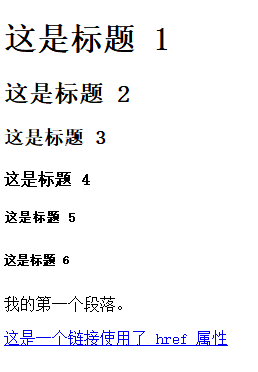
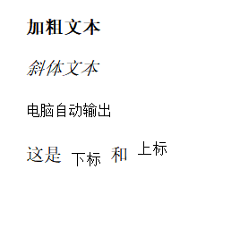
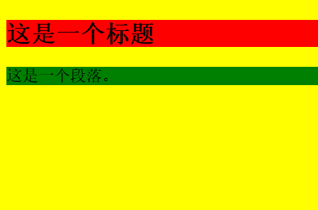
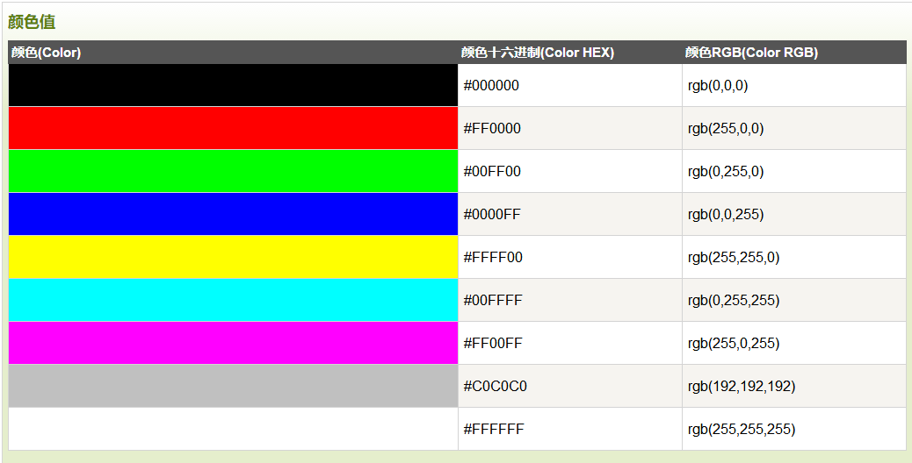
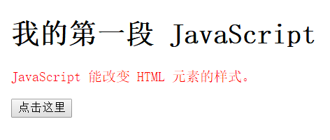
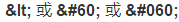

[TOC]

# HTML 教程

超文本标记语言（HyperText Markup Language，HTML）是一种用于创建网页的标准标记语言。

## 简单示例

```html
<!DOCTYPE html>
<html>
<head>
<meta charset="utf-8">
<title>示例</title>
</head>
<body>
    <h1>这是标题 1</h1>
    <h2>这是标题 2</h2>
    <h3>这是标题 3</h3>
    <h4>这是标题 4</h4>
    <h5>这是标题 5</h5>
    <h6>这是标题 6</h6>
    <p>我的第一个段落。</p>
    <hr>
    <p>我的第二个段落。</p>
    <hr>
    <p>我的第三个段落。</p>
    <hr>
    <a href="//www.xuyuan.tw">这是一个链接使用了 href 属性</a>
    
</body>
</html>
```



## 实例解析

- **<!DOCTYPE html>** 声明为 HTML5 文档,不区分大小写
- **<html>** 元素是 HTML 页面的根元素
- **<head>** 元素包含了文档的元（meta）数据，如 **<meta charset="utf-8">** 定义网页编码格式为 **utf-8**。
- **<title>** 元素描述了文档的标题
- **<body>** 元素包含了可见的页面内容
- **<h1>** 元素定义一个大标题
- **<p>** 元素定义一个段落

# HTML 元素

## HTML 元素

| 开始标签             | 元素内容     | 结束标签 |
| :--- | :----- | :--- |
| `<p>`                  | 这是一个段落 | `</p>`    |
| `<a href="default.htm">` | 这是一个链接 | `</a>`     |
| `<br>`                 | 换行         |            |

****开始标签常被称为**起始标签（opening tag）**，结束标签常称为**闭合标签（closing tag）**。

## HTML 元素语法

- HTML 元素以**开始标签**起始
- HTML 元素以**结束标签**终止
- **元素的内容**是开始标签与结束标签之间的内容
- 某些 HTML 元素具有**空内容（empty content）**
- 空元素**在开始标签中进行关闭**（以开始标签的结束而结束）
- 大多数 HTML 元素可拥有**属性**

## 不要忘记结束标签

即使您忘记了使用结束标签，大多数浏览器也会正确地显示 HTML。但不要依赖这种做法。忘记使用结束标签会产生不可预料的结果或错误。

## HTML 空元素

没有内容的 HTML 元素被称为空元素。空元素是在开始标签中关闭的。`<br>` 就是没有关闭标签的空元素（`<br>` 标签定义换行）。在 XHTML、XML 以及未来版本的 HTML 中，所有元素都必须被关闭。在开始标签中添加斜杠，比如 `<br />`，是关闭空元素的正确方法，HTML、XHTML 和 XML 都接受这种方式。即使 `<br>` 在所有浏览器中都是有效的，但使用 `<br />` 其实是更长远的保障。


## 使用小写标签

HTML 标签对大小写不敏感：<P> 等同于 <p>。许多网站都使用大写的 HTML 标签。万维网联盟（W3C）在 HTML 4 中**推荐**使用小写，而在未来 (X)HTML 版本中**强制**使用小写。

# HTML 属性

属性是 HTML 元素提供的附加信息。

- HTML 元素可以设置**属性**
- 属性可以在元素中添加**附加信息**
- 属性一般描述于**开始标签**
- 属性总是以名称/值对的形式出现，**比如：name="value"**。

## 属性实例

HTML 链接由 <a> 标签定义。链接的地址在 **href 属性**中指定： 

```html
<a href="http://www.runoob.com">这是一个链接</a>
```

## HTML 属性常用引用属性值

属性值应该始终被包括在引号内。

双引号是最常用的，不过使用单引号也没有问题。

**提示:** 在某些个别的情况下，比如属性值本身就含有双引号，那么您必须使用单引号，例如：name='John "ShotGun" Nelson'

## HTML 属性参考手册

查看完整的HTML属性列表:  [HTML 标签参考手册](http://www.runoob.com/tags/html-reference.html)。

下面列出了适用于大多数 HTML 元素的属性：

| 属性  | 描述                                                         |
| :---- | :----- |
| class | 为html元素定义一个或多个类名（classname）(类名从样式文件引入) |
| id    | 定义元素的唯一id                                             |
| style | 规定元素的行内样式（inline style）                           |
| title | 描述了元素的额外信息 (作为工具条使用)                        |

更多标准属性说明：  [HTML 标准属性参考手册](http://www.runoob.com/tags/ref-standardattributes.html).

# HTML 标题

## HTML 标题

标题（Heading）是通过 <h1> - <h6> 标签进行定义的.

**注释:** 浏览器会自动地在标题的前后添加空行。

请确保将 HTML 标题 标签只用于标题。不要仅仅是为了生成**粗体**或**大号**的文本而使用标题。因为用户可以通过标题来快速浏览您的网页，所以用标题来呈现文档结构是很重要的。应该将 h1 用作主标题（最重要的），其后是 h2（次重要的），再其次是 h3，以此类推。

## HTML 水平线

```html
<hr> 标签在 HTML 页面中创建水平线。
```

```html
<p>这是一个段落。</p>
<hr>
<p>这是一个段落。</p>
<hr>
<p>这是一个段落。</p>
```

## HTML 注释

```html
<!-- 这是一个注释 -->
```

**注释:** 开始括号之后（左边的括号）需要紧跟一个叹号，结束括号之前（右边的括号）不需要，合理地使用注释可以对未来的代码编辑工作产生帮助。。

## HTML 提示 - 如何查看源代码

单击右键，然后选择"查看源文件"（IE）或"查看页面源代码"（Firefox）。

## HTML 标签参考手册

菜鸟教程的标签参考手册提供了有关这些标题及其属性的更多信息。

您将在本教程下面的章节中学到更多有关 HTML 标签和属性的知识。

| 标签                                            | 描述           |
| :---- | :- |
| [<html>](http://www.runoob.com/tags/tag-html.html) | 定义 HTML 文档 |
| [<body>](http://www.runoob.com/tags/tag-body.html) | 定义文档的主体 |
| [<h1>](http://www.runoob.com/tags/tag-hn.html) | 定义 HTML 标题 |
| [<hr>](http://www.runoob.com/tags/tag-hr.html)  | 定义水平线     |
| [<!--...-->](http://www.runoob.com/tags/tag-comment.html) | 定义注释       |
| [<p>](http://www.runoob.com/tags/tag-p.html) | 定义一个段落 |
| [<br>](http://www.runoob.com/tags/tag-br.html) | 插入单个折行（换行） |

 段落是通过 <p> 标签定义的。

**注意：**浏览器会自动地在段落的前后添加空行。（</p> 是块级元素）

## HTML 折行

如果您希望在不产生一个新段落的情况下进行换行（新行），请使用 **<br>**

```html
<p>这个<br>段落<br>演示了分行的效果</p>
```

`<br />` 元素是一个空的 HTML 元素。由于关闭标签没有任何意义，因此它没有结束标签。

## HTML 输出- 使用提醒

我们无法确定 HTML 被显示的确切效果。屏幕的大小，以及对窗口的调整都可能导致不同的结果。对于 HTML，您无法通过在 HTML 代码中添加额外的空格或换行来改变输出的效果。

当显示页面时，浏览器会移除源代码中多余的空格和空行。所有连续的空格或空行都会被算作一个空格。需要注意的是，HTML 代码中的所有连续的空行（换行）也被显示为**一个空格**。

# HTML 文本格式化

## HTML 文本格式化

```html
<!DOCTYPE html>
<html>
<head> 
<meta charset="utf-8"> 
<title>菜鸟教程(runoob.com)</title> 
</head> 
<body>

<b>加粗文本</b><br><br>
<i>斜体文本</i><br><br>
<code>电脑自动输出</code><br><br>
这是 <sub> 下标</sub> 和 <sup> 上标</sup>

</body>
</html>
```




## HTML 格式化标签

HTML 使用标签 <b>("bold") 与 <i>("italic") 对输出的文本进行格式, 如：**粗体** or *斜体* 

**通常标签 <strong> 替换加粗标签 <b> 来使用, <em> 替换 <i>标签使用。**    然而，这些标签的含义是不同的：    <b> 与<i> 定义粗体或斜体文本。    <strong> 或者 <em>意味着你要呈现的文本是重要的，所以要突出显示。现今所有主要浏览器都能渲染各种效果的字体。不过，未来浏览器可能会支持更好的渲染效果。

```html
<em>强调文本</em><br>
<strong>加粗文本</strong><br>
<dfn>定义项目</dfn><br>
<code>一段电脑代码</code><br>
<samp>计算机样本</samp><br>
<kbd>键盘输入</kbd><br>
<var>变量</var>
```


## HTML 文本格式化标签

| 标签                                           | 描述         |
| :--- | :----- |
| [<b>](http://www.runoob.com/tags/tag-b.html)   | 定义粗体文本 |
| [<em>](http://www.runoob.com/tags/tag-em.html) | 定义着重文字 |
| [<i>](http://www.runoob.com/tags/tag-i.html)   | 定义斜体字   |
| [<small>](http://www.runoob.com/tags/tag-small.html) | 定义小号字   |
| [<strong>](http://www.runoob.com/tags/tag-strong.html) | 定义加重语气 |
| [<sub>](http://www.runoob.com/tags/tag-sub.html) | 定义下标字   |
| [<sup>](http://www.runoob.com/m/tags/tag-sup.html) | 定义上标字   |
| [<ins>](http://www.runoob.com/tags/tag-ins.html) | 定义插入字   |
| [<del>](http://www.runoob.com/tags/tag-del.html) | 定义删除字   |

## HTML "计算机输出" 标签

| 标签                                         | 描述               |
| :- | :----- |
| [<code>](http://www.runoob.com/tags/tag-code.html) | 定义计算机代码     |
| [<kbd>](http://www.runoob.com/tags/tag-kbd.html) | 定义键盘码         |
| [<samp>](http://www.runoob.com/tags/tag-samp.html) | 定义计算机代码样本 |
| [<var>](http://www.runoob.com/tags/tag-var.html) | 定义变量           |
| [<pre>](http://www.runoob.com/tags/tag-pre.html) | 定义预格式文本     |

## HTML 引文, 引用, 及标签定义

| 标签                                               | 描述               |
| :- | :----- |
| [<abbr>](http://www.runoob.com/tags/tag-abbr.html) | 定义缩写           |
| [<address>](http://www.runoob.com/tags/tag-address.html) | 定义地址           |
| [<bdo>](http://www.runoob.com/tags/tag-bdo.html) | 定义文字方向       |
| [<blockquote>](http://www.runoob.com/tags/tag-blockquote.html) | 定义长的引用       |
| [<q>](http://www.runoob.com/tags/tag-q.html)       | 定义短的引用语     |
| [<cite>](http://www.runoob.com/tags/tag-cite.html) | 定义引用、引证     |
| [<dfn>](http://www.runoob.com/tags/tag-dfn.html)   | 定义一个定义项目。 |

<p>该段落文字从左到右显示。</p>  
<p><bdo dir="rtl">该段落文字从右到左显示。</bdo></p>  

<blockquote cite="http://www.worldwildlife.org/who/index.html">
For 50 years, WWF has been protecting the future of nature. The world's leading conservation organization, WWF works in 100 countries and is supported by 1.2 million members in the United States and close to 5 million globally.
</blockquote>

# HTML 链接

HTML使用标签 <a>来设置超文本链接。

在标签<a> 中使用了href属性来描述链接的地址。

默认情况下，链接将以以下形式出现在浏览器中：

- 一个未访问过的链接显示为蓝色字体并带有下划线。
- 访问过的链接显示为紫色并带有下划线。
- 点击链接时，链接显示为红色并带有下划线。

> 注意：如果为这些超链接设置了 CSS 样式，展示样式会根据 CSS 的设定而显示。

```html
<a href="url">链接文本</a>
```

href 属性描述了链接的目标。

## HTML 链接 - target 属性

使用 target 属性，你可以定义被链接的文档在何处显示。

```html
<a href="http://www.runoob.com/" target="_blank">访问菜鸟教程!</a>
```

## HTML 链接 - id 属性

id属性可用于创建在一个HTML文档书签标记。

**提示:** 书签是不以任何特殊的方式显示，在HTML文档中是不显示的，所以对于读者来说是隐藏的。

在HTML文档中插入ID:

```html
<a id="tips">有用的提示部分</a>
```

在HTML文档中创建一个链接到"有用的提示部分(id="tips"）"：

```html
<a href="#tips">访问有用的提示部分</a>
```

或者，从另一个页面创建一个链接到"有用的提示部分(id="tips"）"：

```html
<a href="http://www.runoob.com/html/html-links.html#tips">

 访问有用的提示部分</a>
```

**注释：** 请始终将正斜杠添加到子文件夹。

# HTML <head>

## HTML `<head>` 元素

<head> 元素包含了所有的头部标签元素。在  <head>元素中你可以插入脚本（scripts）, 样式文件（CSS），及各种meta信息。

可以添加在头部区域的元素标签为: <title>, <style>,   <meta>, <link>,   <script>, <noscript>, and <base>.

## HTML `<title>` 元素


- 定义了浏览器工具栏的标题
- 当网页添加到收藏夹时，显示在收藏夹中的标题
- 显示在搜索引擎结果页面的标题

## HTML `<base>` 元素

<base> 标签描述了基本的链接地址/链接目标，该标签作为HTML文档中所有的链接标签的默认链接:


```html
<head>
<base href="http://www.runoob.com/images/" target="_blank">
</head>
```

## HTML `<link>` 元素

<link> 标签定义了文档与外部资源之间的关系。

<link> 标签通常用于链接到样式表:

```html
<head>
<link rel="stylesheet" type="text/css" href="mystyle.css">
</head>
```

## HTML `<style>` 元素

<style> 标签定义了HTML文档的样式文件引用地址.

在<style> 元素中你也可以直接添加样式来渲染 HTML 文档:

```
<head>
<style type="text/css">
body {background-color:yellow}
p {color:blue}
</style>
</head>
```

## HTML `<meta>` 元素

<meta> 标签提供了元数据.元数据也不显示在页面上，但会被浏览器解析。
<meta> 一般放置于 <head> 区域


META 元素通常用于指定网页的描述，关键词，文件的最后修改时间，作者，和其他元数据。可以使用于浏览器（如何显示内容或重新加载页面），搜索引擎（关键词），或其他Web服务。

为搜索引擎定义关键词:

```html
<meta name="keywords" content="HTML, CSS, XML, XHTML, JavaScript">
```

为网页定义描述内容:

```html
<meta name="description" content="免费 Web & 编程 教程">
```

定义网页作者:

```html
<meta name="author" content="Runoob">
```

每30秒钟刷新当前页面:

```html
<meta http-equiv="refresh" content="30">
```


## HTML `<script>` 元素

<script>标签用于加载脚本文件，如： JavaScript。

<script> 元素在以后的章节中会详细描述。
# HTML 样式- CSS


CSS (Cascading Style Sheets) 用于渲染HTML元素标签的样式.

```html
<!DOCTYPE html>
<html>
<head> 
<meta charset="utf-8"> 
<title>菜鸟教程(runoob.com)</title> 
</head>
<body>

<div style="opacity:0.5;position:absolute;left:50px;width:300px;height:150px;background-color:#40B3DF"></div>

<div style="font-family:verdana;padding:20px;border-radius:10px;border:10px solid #EE872A;">

<div style="opacity:0.3;position:absolute;left:120px;width:100px;height:200px;background-color:#8AC007"></div>

<h3>Look! Styles and colors</h3>

<div style="letter-spacing:12px;">Manipulate Text</div>

<div style="color:#40B3DF;">Colors
<span style="background-color:#B4009E;color:#ffffff;">Boxes</span>
</div>

<div style="color:#000000;">and more...</div>

</div>

</body>
</html>
```


CSS 是在 HTML 4 开始使用的,是为了更好的渲染HTML元素而引入的.CSS 可以通过以下方式添加到HTML中:

- 内联样式- 在HTML元素中使用"style" **属性**
- 内部样式表 -在HTML文档头部 <head> 区域使用<style> **元素** 来包含CSS
- 外部引用 - 使用外部 CSS **文件**

最好的方式是通过外部引用CSS文件.HTML教程中我们使用了内联CSS样式来介绍实例.


## 内联样式

当特殊的样式需要应用到个别元素时，就可以使用内联样式。 使用内联样式的方法是在相关的标签中使用样式属性。样式属性可以包含任何 CSS 属性。以下实例显示出如何改变段落的颜色和左外边距。

<p style="color:blue;margin-left:20px;">This is a paragraph.</p>

## HTML样式实例 - 背景颜色

背景色属性（background-color）定义一个元素的背景颜色：

```
<body style="background-color:yellow;"> 
<h2 style="background-color:red;">这是一个标题</h2> 
<p style="background-color:green;">这是一个段落。</p> 
</body>
```




## HTML 样式实例 - 字体, 字体颜色 ，字体大小

我们可以使用font-family（字体），color（颜色），和font-size（字体大小）属性来定义字体的样式:

<h1 style="font-family:verdana;">一个标题</h1> 
<p style="font-family:arial;color:red;font-size:20px;">一个段落。</p>

## HTML 样式实例 - 文本对齐方式

使用 text-align（文字对齐）属性指定文本的水平与垂直对齐方式：

<h1 style="text-align:center;">居中对齐的标题</h1> 
<p>这是一个段落。</p>

## 内部样式表

当**单个文件需要特别样式**时，就可以使用内部样式表。你可以在<head> 部分通过 <style>标签定义内部样式表:

```html
<head>
<style type="text/css">
body {background-color:yellow;}
p {color:blue;}
</style>
</head>
```

## 外部样式表

当样式需要**被应用到很多页面**的时候，外部样式表将是理想的选择。使用外部样式表，你就可以通过更改一个文件来改变整个站点的外观。

```html
<head>
<link rel="stylesheet" type="text/css" href="mystyle.css">
</head>     
```

# HTML 图像

## HTML 图像- 图像标签（ ）和源属性（Src）

在 HTML 中，图像由 标签定义。

 是空标签，意思是说，它只包含属性，并且没有闭合标签。

要在页面上显示图像，你需要使用源属性（src）。src 指 "source"。源属性的值是图像的 URL 地址。

**定义图像的语法是：**

```html

```

  URL 指存储图像的位置。如果名为 "pulpit.jpg" 的图像位于 www.runoob.com 的 images 目录中，那么其 URL 为 <http://www.runoob.com/images/pulpit.jpg>。 

浏览器将图像显示在文档中**图像标签出现的地方**。如果你将图像标签置于两个段落之间，那么浏览器会首先显示第一个段落，然后显示图片，最后显示第二段。 

##   HTML  图像- Alt属性

  alt 属性用来为图像定义一串预备的可替换的文本。

  替换文本属性的值是用户定义的。 

```html

```

在浏览器无法载入图像时，替换文本属性告诉读者她们失去的信息。此时，浏览器将显示这个替代性的文本而不是图像。为页面上的图像都加上替换文本属性是个好习惯，这样有助于更好的显示信息，并且对于那些使用纯文本浏览器的人来说是非常有用的。

##   HTML 图像- 设置图像的高度与宽度

  height（高度） 与 width（宽度）属性用于设置图像的高度与宽度。

  属性值默认单位为像素:

```html

```

**提示:** 指定图像的高度和宽度是一个很好的习惯。如果图像指定了高度宽度，页面加载时就会保留指定的尺寸。如果没有指定图片的大小，加载页面时有可能会破坏HTML页面的整体布局。

## 基本的注意事项 - 有用的提示：

**注意:** 假如某个 HTML 文件包含十个图像，那么为了正确显示这个页面，需要加载 11 个文件。加载图片是需要时间的，所以我们的建议是：慎用图片。 

**注意:** 加载页面时，要注意插入页面图像的路径，如果不能正确设置图像的位置，浏览器无法加载图片，图像标签就会显示一个破碎的图片。

## HTML 图像标签

| 标签                                         | 描述                       |
| :- | :- |
| [](http://www.runoob.com/tags/tag-img.html) | 定义图像                   |
| [<map>](http://www.runoob.com/tags/tag-map.html) | 定义图像地图               |
| [<area>](http://www.runoob.com/tags/tag-area.html) | 定义图像地图中的可点击区域 |

# HTML 表格

表格由 <table> 标签来定义。每个表格均有若干行（由 <tr> 标签定义），每行被分割为若干单元格（由 <td> 标签定义）。字母 td 指表格数据（table data），即数据单元格的内容。数据单元格可以包含文本、图片、列表、段落、表单、水平线、表格等等。

<table border="1">
    <tr>
        <th>Header 1</th>
        <th>Header 2</th>
    </tr>
    <tr>
        <td>row 1, cell 1</td>
        <td>row 1, cell 2</td>
    </tr>
    <tr>
        <td>row 2, cell 1</td>
        <td>row 2, cell 2</td>
    </tr>
</table>

## HTML 表格和边框属性

如果不定义边框属性，表格将不显示边框。有时这很有用，但是大多数时候，我们希望显示边框。 

## HTML 表格表头

表格的表头使用 <th> 标签进行定义。

# HTML 列表

HTML 支持有序、无序和定义列表:

## HTML无序列表

无序列表是一个项目的列表，此列项目使用粗体圆点（典型的小黑圆圈）进行标记。

无序列表使用 <ul> 标签

<ul>
<li>Coffee</li>
<li>Milk</li>
</ul>

## HTML 有序列表

同样，有序列表也是一列项目，列表项目使用数字进行标记。 有序列表始于 <ol> 标签。每个列表项始于 <li> 标签。

列表项使用数字来标记。

<ol>
<li>Coffee</li>
<li>Milk</li>
</ol>


## HTML 自定义列表

自定义列表不仅仅是一列项目，而是项目及其注释的组合。

自定义列表以 <dl> 标签开始。每个自定义列表项以 <dt> 开始。每个自定义列表项的定义以 <dd> 开始。

<dl>
<dt>Coffee</dt>
<dd>- black hot drink</dd>
<dt>Milk</dt>
<dd>- white cold drink</dd>
</dl>

# HTML `<div>` 和`<span>`


HTML 可以通过 <div> 和 <span>将元素组合起来。


## HTML 区块元素

大多数 HTML 元素被定义为**块级元素**或**内联元素**。

块级元素在浏览器显示时，通常会以新行来开始（和结束）。

实例: <h1>, <p>, <ul>, <table>

## HTML 内联元素

内联元素在显示时通常不会以新行开始。

实例: <b>, <td>, <a>, 

## HTML `<div>` 元素

HTML <div> 元素是块级元素，它可用于组合其他 HTML 元素的容器。

<div> 元素没有特定的含义。除此之外，由于它属于块级元素，浏览器会在其前后显示折行。

如果与 CSS 一同使用，<div> 元素可用于对大的内容块设置样式属性。

使用 <table> 元素进行文档布局不是表格的正确用法。

## HTML `<span>` 元素

HTML <span> 元素是内联元素，可用作文本的容器

<span> 元素也没有特定的含义。

当与 CSS 一同使用时，<span> 元素可用于为部分文本设置样式属性。

# HTML 布局

## 网站布局

大多数网站会把内容安排到多个列中（就像杂志或报纸那样）。

大多数网站可以使用 <div> 或者 <table> 元素来创建多列。CSS 用于对元素进行定位，或者为页面创建背景以及色彩丰富的外观。

## HTML 布局 - 使用`<div>` 元素

div 元素是用于分组 HTML 元素的块级元素。

下面的例子使用五个 div 元素来创建多列布局：

```HTML
<!DOCTYPE html>
<html>
<head> 
<meta charset="utf-8"> 
<title>菜鸟教程(runoob.com)</title> 
</head>
<body>

<div id="container" style="width:500px">

<div id="header" style="background-color:#FFA500;">
<h1 style="margin-bottom:0;">主要的网页标题</h1></div>

<div id="menu" style="background-color:#FFD700;height:200px;width:100px;float:left;">
<b>菜单</b><br>
HTML<br>
CSS<br>
JavaScript</div>

<div id="content" style="background-color:#EEEEEE;height:200px;width:400px;float:left;">
内容在这里</div>

<div id="footer" style="background-color:#FFA500;clear:both;text-align:center;">
版权 © runoob.com</div>

</div>
 
</body>
</html>
```


## HTML 布局 - 使用表格

使用 HTML <table> 标签是创建布局的一种简单的方式。

大多数站点可以使用 <div> 或者 <table> 元素来创建多列。CSS 用于对元素进行定位，或者为页面创建背景以及色彩丰富的外观。

下面的例子使用三行两列的表格 - 第一和最后一行使用 colspan 属性来横跨两列：

```HTML
<!DOCTYPE html>
<html>
<head> 
<meta charset="utf-8"> 
<title>菜鸟教程(runoob.com)</title> 
</head>
<body>
 
<table width="500" border="0">
<tr>
<td colspan="2" style="background-color:#FFA500;">
<h1>主要的网页标题</h1>
</td>
</tr>
 
<tr>
<td style="background-color:#FFD700;width:100px;">
<b>菜单</b><br>
HTML<br>
CSS<br>
JavaScript
</td>
<td style="background-color:#eeeeee;height:200px;width:400px;">
内容在这里</td>
</tr>
 
<tr>
<td colspan="2" style="background-color:#FFA500;text-align:center;">
版权 © runoob.com</td>
</tr>
</table>
 
</body>
</html>
```

上面的 HTML 代码会产生以下结果：


## HTML 布局 - 有用的提示

**Tip:** 使用 CSS 最大的好处是，如果把 CSS 代码存放到外部样式表中，那么站点会更易于维护。通过编辑单一的文件，就可以改变所有页面的布局。如需学习更多有关 CSS 的知识，请访问我们的[CSS 教程](http://www.runoob.com/css/css-tutorial.html)。

**Tip:** 由于创建高级的布局非常耗时，使用模板是一个快速的选项。通过搜索引擎可以找到很多免费的网站模板（您可以使用这些预先构建好的网站布局，并优化它们）。

# HTML 表单和输入

HTML 表单用于收集不同类型的用户输入。

表单元素是允许用户在表单中输入内容,比如：文本域(textarea)、下拉列表、单选框(radio-buttons)、复选框(checkboxes)等等。

表单使用表单标签 <form> 来设置:

```HTML
<form>
.
input 元素
.
</form>
```

## HTML 表单 - 输入元素

多数情况下被用到的表单标签是输入标签（<input>）。

输入类型是由类型属性（type）定义的。大多数经常被用到的输入类型如下：

## 文本域（Text Fields）

文本域通过<input type="text"> 标签来设定，当用户要在表单中键入字母、数字等内容时，就会用到文本域。

<form>
First name:  <input type="text" name="firstname">
<br>
Last name:  <input type="text" name="lastname">
</form> 

**注意:**表单本身并不可见。同时，在大多数浏览器中，文本域的**缺省宽度是20个字符**。 

## 密码字段

密码字段通过标签<input type="password"> 来定义:

  <form>
  Password:  <input type="password" name="pwd">
  </form> 

**注意:**密码字段字符不会明文显示，而是以星号或圆点替代。

## 单选按钮（Radio Buttons）

<input type="radio"> 标签定义了表单单选框选项

  <form>
  <input type="radio" name="sex" value="male">Male<br>
  <input type="radio" name="sex" value="female">Female
  </form> 
## 复选框（Checkboxes）

<input type="checkbox"> 定义了复选框. 用户需要从若干给定的选择中选取一个或若干选项。

  <form>
  <input type="checkbox" name="vehicle" value="Bike">I have a bike<br>
  <input type="checkbox" name="vehicle" value="Car">I have a car 
  </form> 
## 提交按钮(Submit Button)

<input type="submit"> 定义了提交按钮.

当用户单击确认按钮时，表单的内容会被传送到另一个文件。表单的动作属性定义了目的文件的文件名。由动作属性定义的这个文件通常会对接收到的输入数据进行相关的处理。:

  <form name="input" action="html_form_action.php" method="get">
  Username:  <input type="text" name="user">
  <input type="submit" value="Submit">
  </form> 
如在上面的文本框内键入几个字母，然后点击确认按钮，那么输入数据会传送到 "html_form_action.php" 的页面。该页面将显示出输入的结果。 

# HTML 框架

通过使用框架，你可以在同一个浏览器窗口中显示不止一个页面。

<iframe src="http://www.runoob.com/html/" height="300px" width="99%" style="border: 0px; margin: 0px; padding: 0px;"></iframe>

## Iframe - 设置高度与宽度

height 和 width 属性用来定义iframe标签的高度与宽度。

属性默认以像素为单位, 但是你可以指定其按比例显示 (如："80%")。

```HTML
<iframe src="demo_iframe.htm" width="200" height="200"></iframe>
```

## Iframe - 移除边框

frameborder 属性用于定义iframe表示是否显示边框。

设置属性值为 "0" 移除iframe的边框:

```HTML
<iframe src="demo_iframe.htm" frameborder="0"></iframe>
```

## 使用iframe来显示目标链接页面

iframe可以显示一个目标链接的页面

目标链接的属性必须使用iframe的属性，如下实例:

```HTML
<iframe src="demo_iframe.htm" name="iframe_a"></iframe>
<p><a href="http://www.runoob.com" target="iframe_a">RUNOOB.COM</a></p>
```

# HTML 颜色

------

HTML 颜色由红色、绿色、蓝色混合而成。

------

## 颜色值

HTML 颜色由一个十六进制符号来定义，这个符号由红色、绿色和蓝色的值组成（RGB）。

每种颜色的最小值是0（十六进制：#00）。最大值是255（十六进制：#FF）。

这个表格给出了由三种颜色混合而成的具体效果：

## 颜色名

141个颜色名称是在HTML和CSS颜色规范定义的（17标准颜色，再加124）。下表列出了所有颜色的值，包括十六进制值。[141](https://www.runoob.com/html/html-colornames.html)

# HTML 脚本

JavaScript 使 HTML 页面具有更强的动态和交互性。

## HTML `<script>` 标签

<script> 标签用于定义客户端脚本，比如 JavaScript。

<script> 元素既可包含脚本语句，也可通过 src 属性指向外部脚本文件。

JavaScript 最常用于图片操作、表单验证以及内容动态更新。

## HTML`<noscript>` 标签

<noscript> 标签提供无法使用脚本时的替代内容，比方在浏览器禁用脚本时，或浏览器不支持客户端脚本时。

<noscript>元素可包含普通 HTML 页面的 body 元素中能够找到的所有元素。

只有在浏览器不支持脚本或者禁用脚本时，才会显示 <noscript> 元素中的内容：

```javascript
<script>
document.write("Hello World!")
</script>
<noscript>抱歉，你的浏览器不支持 JavaScript!</noscript>
```

## JavaScript体验

```javascript
document.write("<p>这是一个段落。</p>");
```

## JavaScript事件响应:

```javascript
<button type="button" onclick="myFunction()">点我！</button>
```

## JavaScript处理 HTML 样式:

```HTML
<!DOCTYPE html>
<html>
<head> 
<meta charset="utf-8"> 
<title>菜鸟教程(runoob.com)</title> 
</head>
<body>
	
<h1>我的第一段 JavaScript</h1>
<p id="demo">
JavaScript 能改变 HTML 元素的样式。
</p>
<script>
function myFunction()
{
	x=document.getElementById("demo") // 找到元素
	x.style.color="#ff0000";          // 改变样式
}
</script>
<button type="button" onclick="myFunction()">点击这里</button>
	
</body>
</html>
```



# HTML 字符实体

------

HTML 中的预留字符必须被替换为字符实体。

一些在键盘上找不到的字符也可以使用字符实体来替换。

------

## HTML 实体

在 HTML 中，某些字符是预留的。

在 HTML 中不能使用小于号（<）和大于号（>），这是因为浏览器会误认为它们是标签。

如果希望正确地显示预留字符，我们必须在 HTML 源代码中使用字符实体（character entities）。 字符实体类似这样：

```
&entity_name;
&#entity_number;
```

如需显示小于号，我们必须这样写：

## 不间断空格(Non-breaking Space)

HTML 中的常用字符实体是不间断空格(`&nbsp;`)。

浏览器总是会截短 HTML 页面中的空格。如果您在文本中写 10 个空格，在显示该页面之前，浏览器会删除它们中的 9 个。如需在页面中增加空格的数量，您需要使用 &nbsp; 字符实体。

## 结合音标符

发音符号是加到字母上的一个"glyph(字形)"。

一些变音符号, 如 尖音符 (  ̀) 和 抑音符 (  ́) 。

变音符号可以出现字母的上面和下面，或者字母里面，或者两个字母间。

变音符号可以与字母、数字字符的组合来使用。

以下是一些实例:

| 音标符 | 字符 | Construct | 输出结果 |
| :----- | :--- | --------- | :------- |
| ̀       | a    | `a&#768;` | à        |
| ́       | a    | `a&#769;` | á        |
| ̂       | a    | `a&#770;` | â        |
| ̃       | a    | `a&#771;` | ã        |

## HTML字符实体

| 显示结果 | 描述        | 实体名称          | 实体编号 |
| :------- | :---------- | :---------------- | :------- |
|          | 空格        | &nbsp;            | &#160;   |
| <        | 小于号      | &lt;              | &#60;    |
| >        | 大于号      | &gt;              | &#62;    |
| &        | 和号        | &amp;             | &#38;    |
| "        | 引号        | &quot;            | &#34;    |
| '        | 撇号        | &apos; (IE不支持) | &#39;    |
| ￠       | 分          | &cent;            | &#162;   |
| £        | 镑          | &pound;           | &#163;   |
| ¥        | 人民币/日元 | &yen;             | &#165;   |
| €        | 欧元        | &euro;            | &#8364;  |
| §        | 小节        | &sect;            | &#167;   |
| ©        | 版权        | &copy;            | &#169;   |
| ®        | 注册商标    | &reg;             | &#174;   |
| ™        | 商标        | &trade;           | &#8482;  |
| ×        | 乘号        | &times;           | &#215;   |
| ÷        | 除号        | &divide;          | &#247;   |

虽然 html 不区分大小写，但实体字符对大小写敏感。

# HTML 统一资源定位器(Uniform Resource Locators)

------

URL 是一个网页地址。

URL可以由字母组成，如"runoob.com"，或互联网协议（IP）地址： 192.68.20.50。大多数人进入网站使用网站域名来访问，因为 名字比数字更容易记住。

------

## URL - 统一资源定位器

Web浏览器通过URL从Web服务器请求页面。

当您点击 HTML 页面中的某个链接时，对应的 <a> 标签指向万维网上的一个地址。

一个统一资源定位器(URL) 用于定位万维网上的文档。

一个网页地址实例: <http://www.runoob.com/html/html-tutorial.html> 语法规则:

**scheme://host.domain:port/path/filename**

说明:

- - scheme - 定义因特网服务的类型。最常见的类型是 http
  - host - 定义域主机（http 的默认主机是 www）
  - domain - 定义因特网域名，比如 runoob.com
  - :port - 定义主机上的端口号（http 的默认端口号是 80）
  - path - 定义服务器上的路径（如果省略，则文档必须位于网站的根目录中）。
  - filename - 定义文档/资源的名称

------

## 常见的 URL Scheme

以下是一些URL scheme：

| Scheme | 访问               | 用于...                             |
| :----- | :----------------- | :---------------------------------- |
| http   | 超文本传输协议     | 以 http:// 开头的普通网页。不加密。 |
| https  | 安全超文本传输协议 | 安全网页，加密所有信息交换。        |
| ftp    | 文件传输协议       | 用于将文件下载或上传至网站。        |
| file   |                    | 您计算机上的文件。                  |

------

## URL 字符编码

URL 只能使用 [ASCII 字符集](https://www.runoob.com/tags/html-ascii.html).来通过因特网进行发送。由于 URL 常常会包含 ASCII 集合之外的字符，URL 必须转换为有效的 ASCII 格式。

URL 编码使用 "%" 其后跟随两位的十六进制数来替换非 ASCII 字符。

URL 不能包含空格。URL 编码通常使用 + 来替换空格。

| 字符 | URL 编码 |
| :--- | :------- |
| €    | %80      |
| £    | %A3      |
| ©    | %A9      |
| ®    | %AE      |
| À    | %C0      |
| Á    | %C1      |
| Â    | %C2      |
| Ã    | %C3      |
| Ä    | %C4      |
| Å    | %C5      |

如需完整的 URL 编码参考，请访问我们的 [URL 编码参考手册](https://www.runoob.com/tags/html-urlencode.html)。

# HTML 速查列表

## HTML 基本文档

```HTML
<!DOCTYPE html> <html> <head> <title>文档标题</title> </head> <body> 可见文本... </body> </html>
```

## 基本标签（Basic Tags）

```HTML
<h1>最大的标题</h1>
<h2> . . . </h2>
<h3> . . . </h3>
<h4> . . . </h4>
<h5> . . . </h5>
<h6>最小的标题</h6>
 
<p>这是一个段落。</p>
<br> （换行）
<hr> （水平线）
<!-- 这是注释 -->
```

## 文本格式化（Formatting）

```HTML
<b>粗体文本</b>
<code>计算机代码</code>
<em>强调文本</em>
<i>斜体文本</i>
<kbd>键盘输入</kbd> 
<pre>预格式化文本</pre>
<small>更小的文本</small>
<strong>重要的文本</strong>
<abbr> （缩写）
<address> （联系信息）
<bdo> （文字方向）
<blockquote> （从另一个源引用的部分）
<cite> （工作的名称）
<del> （删除的文本）
<ins> （插入的文本）
<sub> （下标文本）
<sup> （上标文本）
```

## 链接（Links）

```HTML
普通的链接：<a href="http://www.example.com/">链接文本</a> 
图像链接： <a href="http://www.example.com/"></a> 
邮件链接： <a href="mailto:webmaster@example.com">发送e-mail</a> 
书签： <a id="tips">提示部分</a> <a href="#tips">跳到提示部分</a>
```

## 图片（Images）

```HTML

```

## 样式/区块（Styles/Sections）

```HTML
<style type="text/css">
h1 {color:red;}
p {color:blue;}
</style>
<div>文档中的块级元素</div>
<span>文档中的内联元素</span>
```

## 无序列表

```HTML
<ul>     <li>项目</li>     <li>项目</li> </ul>
```

## 有序列表

```HTML
<ol>     <li>第一项</li>     <li>第二项</li> </ol>
```

## 定义列表

```HTML
<dl>
  <dt>项目 1</dt>
    <dd>描述项目 1</dd>
  <dt>项目 2</dt>
    <dd>描述项目 2</dd>
</dl>
```

## 表格（Tables）

```HTML
<table border="1">
  <tr>
    <th>表格标题</th>
    <th>表格标题</th>
  </tr>
  <tr>
    <td>表格数据</td>
    <td>表格数据</td>
  </tr>
</table>
```

------

## 框架（Iframe）

```html
<iframe src="demo_iframe.htm"></iframe>
```

## 表单（Forms）

```html
<form action="demo_form.php" method="post/get">
<input type="text" name="email" size="40" maxlength="50">
<input type="password">
<input type="checkbox" checked="checked">
<input type="radio" checked="checked">
<input type="submit" value="Send">
<input type="reset">
<input type="hidden">
<select>
<option>苹果</option>
<option selected="selected">香蕉</option>
<option>樱桃</option>
</select>
<textarea name="comment" rows="60" cols="20"></textarea>
</form>
```

## 实体（Entities）

```html
&lt; 等同于 <
&gt; 等同于 >
&#169; 等同于 ©
```

