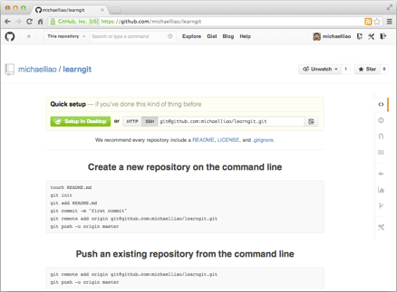
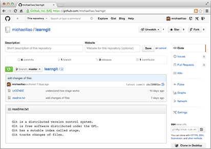

[TOC]


**主要参考[廖雪峰git教程](https://www.liaoxuefeng.com/wiki/896043488029600)**

目标：理解版本控制系统+使用git工具完成Github功能

## Git简介

Git：分布式版本控制系统。

示例

| 版本 | 文件名      | 用户 | 说明                   | 日期       |
| :--- | :---------- | :--- | :--------------------- | :--------- |
| 1    | service.doc | 张三 | 删除了软件服务条款5    | 7/12 10:38 |
| 2    | service.doc | 张三 | 增加了License人数限制  | 7/12 18:09 |
| 3    | service.doc | 李四 | 财务部门调整了合同金额 | 7/13 9:51  |
| 4    | service.doc | 张三 | 延长了免费升级周期     | 7/14 15:17 |

### Git历史：Linux 代码管理

Linus在1991年创建了开源的Linux

但Linux的壮大是靠全世界热心的志愿者参与的，这么多人在世界各地为Linux编写代码，那Linux的代码是如何管理的呢？

2002年以前，世界各地的志愿者把源代码文件通过diff的方式发给Linus，然后由Linus本人通过手工方式合并代码！

2002年，Linux代码库之大让Linus很难继续通过手工方式管理了，于是Linus选择了一个商业的版本控制系统BitKeeper，BitKeeper授权Linux社区免费使用这个版本控制系统。

2005年，开发Samba的Andrew试图破解BitKeeper的协议，被BitMover公司发现了，于是BitMover公司要收回Linux社区的免费使用权。

Linus花了两周时间**自己用C写了一个分布式版本控制系统，这就是Git**

Git迅速成为最流行的分布式版本控制系统，尤其是2008年，GitHub网站上线了，它为开源项目免费提供Git存储，无数开源项目开始迁移至GitHub，包括jQuery，PHP，Ruby等等。

### 集中式与分布式

#### 集中式vs分布式

集中式和分布式版本控制系统有什么区别呢？

集中式版本控制系统：版本库是集中存放在中央服务器的，要先从中央服务器取得最新的版本，然后开始干活，干完活了，再把自己的活推送给中央服务器。缺点：需要联网


分布式版本控制系统：首先，没有“中央服务器”，每个人的电脑上都是一个完整的版本库，多人协作时，只需把各自的修改推送给对方，就可以互相看到对方的修改了。

优点：安全性高，分支管理

分布式版本控制系统通常也有一台充当“中央服务器”的电脑，但这个服务器的作用仅仅是用来方便“交换”大家的修改。


## Git安装（windows）

[官网下载](https://git-scm.com/download/win)


安装完成后，在开始菜单里找到“Git”->“Git Bash”


```git
$ git config --global user.name "Your Name"
$ git config --global user.email "email@example.com"
```


## 创建版本库

版本库又名仓库，英文名**repository**，你可以简单理解成一个目录，这个目录里面的所有文件都可以被Git管理起来，每个文件的修改、删除，Git都能跟踪，以便任何时刻都可以追踪历史，或者在将来某个时刻可以“还原”。

首先，选择一个合适的地方，创建一个空目录：


第二步，通过`git init`命令把这个目录变成Git可以管理的仓库：

`git init`
`Initialized empty Git repository in C:/Users/yyzhao/Desktop/git/.git/`


### 把文件添加到版本库

所有的版本控制系统，其实只能跟踪文本文件的改动，比如TXT文件，网页，所有的程序代码等等

不幸的是，Microsoft的Word格式是二进制格式，因此，版本控制系统是没法跟踪Word文件的改动的

如果要真正使用版本控制系统，就要以纯文本方式编写文件。

#### 具体步骤

编写一个`readme.txt`文件，内容如下：

```
Git is a version control system.
Git is free software.
```

放到`git`目录下（子目录也行），因为这是一个Git仓库，放到其他地方Git再厉害也找不到这个文件。

第一步，用命令`git add`告诉Git，把文件添加到仓库：

```
git add readme.txt
```


第二步，用命令`git commit`告诉Git，把文件提交到仓库：

```
git commit -m "wrote a test file"
```


`git commit`命令，`-m`后面输入的是提交说明，可以输入任意内容，从历史记录里方便地找到改动记录。

`git commit`命令执行成功后会告诉你，`1 file changed`：1个文件被改动（我们新添加的readme.txt文件）；`2 insertions`：插入了两行内容（readme.txt有两行内容）。

## 修改变动

继续修改readme.txt文件，改成如下内容：

```
Git is a distributed version control system.
Git is free software.
```

现在，运行`git status`命令看看结果：


> 修改的包括正在写的MD文档，txt文件，相应图片

查看修改了什么，使用`git diff`


之后就是`git add`和`git commit`


> 而markdown文件的commit就无法看到细节的更新的，先commit一下：


### 版本回退

再次更新readme.txt，并提交

```
Git is a distributed version control system.
Git is free software distributed under the GPL.
```


每次的更新日志用`git log`命令查看


加上`--pretty=oneline`参数简化信息


现在我们启动时光穿梭机，准备把`readme.txt`回退到上一个版本，也就是`add distributed`的那个版本。

首先，Git必须知道当前版本是哪个版本，在Git中，用`HEAD`表示当前版本，也就是最新的提交`0cb3...`，上一个版本就是`HEAD^`，上上一个版本就是`HEAD^^`，当然往上100个版本写100个`^`比较容易数不过来，所以写成`HEAD~100`。

现在，我们要把当前版本`append GPL`回退到上一个版本`add distributed`，就可以使用`git reset`命令：

```
git reset --hard HEAD^^
```


回退到229e那个版本了，打开readme.txt查看，发现已经改变

改成新的，要根据commit id来看，最新的开头是bdad5...


同时可以使用`git reflog`查询你的命令记录


### 工作区 暂存区

工作区：就是你在电脑里能看到的目录

版本库：隐藏目录`.git`存储了各种分支

版本库里存了很多东西，其中最重要的就是称为stage（或者叫index）的暂存区

需要提交的文件修改通通放到暂存区，然后，一次性提交暂存区的所有修改。

`git add`命令实际上就是把要提交的所有修改放到暂存区（Stage），然后，执行`git commit`就可以一次性把暂存区的所有修改提交到分支。

### 管理修改

注意错误的操作过程：

> 第一次修改 -> `git add` -> 第二次修改 -> `git commit`

Git管理的是修改，当你用`git add`命令后，在工作区的第一次修改被放入暂存区，准备提交，但是，在工作区的第二次修改并没有放入暂存区，所以，`git commit`只负责把暂存区的修改提交了，也就是第一次的修改被提交了，第二次的修改不会被提交。

正确补救的操作过程

> 第一次修改 -> `git add` -> 第二次修改 -> `git add` -> `git commit`

### 撤销修改

`git checkout -- file`可以丢弃工作区的修改：（留意`--`）

```
git checkout -- readme.txt
```

这里有两种情况：

一种是`readme.txt`自修改后还没有被放到暂存区，现在，撤销修改就回到和版本库一模一样的状态；

一种是`readme.txt`已经添加到暂存区后，又作了修改，现在，撤销修改就回到添加到暂存区后的状态。

总之，就是让这个文件回到最近一次`git commit`或`git add`时的状态。

如果修改提交到了暂存区：

用命令`git reset HEAD <file>`可以把暂存区的修改撤销掉（unstage），重新放回工作区，再进行`git checkout`


### 删除文件

命令`git rm`用于删除一个文件。如果一个文件已经被提交到版本库，那么你永远不用担心误删，恢复方法：

```
git checkout -- test.txt
```


但是要小心，你只能恢复文件到最新版本，你会丢失**最近一次提交后你修改的内容**。

## Github远程仓库

### Github设置

你已经在本地创建了一个Git仓库后，又想在GitHub创建一个Git仓库，并且让这两个仓库进行远程同步，这样，GitHub上的仓库既可以作为备份，又可以让其他人通过该仓库来协作，真是一举多得。

首先，登陆GitHub，然后，在右上角找到“Create a new repo”按钮，创建一个新的仓库：


在Repository name填入`learngit`，其他保持默认设置，点击“Create repository”按钮，就成功地创建了一个新的Git仓库：



目前，在GitHub上的这个`learngit`仓库还是空的，GitHub告诉我们，可以从这个仓库克隆出新的仓库，也可以把一个已有的本地仓库与之关联，然后，把本地仓库的内容推送到GitHub仓库。


要添加一个新的远程仓库，可以指定一个简单的名字，以便将来引用,命令格式如下：

```
git remote add [shortname] [url]
```

本例以 Github 为例作为远程仓库，如果你没有 Github 可以在官网 <https://github.com/>注册。


由于你的本地 Git 仓库和 GitHub 仓库之间的传输是通过SSH加密的，所以我们需要配置验证信息：

使用以下命令生成 SSH Key：

```
$ ssh-keygen -t rsa -C "youremail@example.com"
```

后面的 **your_email@youremail.com** 改为你在 Github 上注册的邮箱，之后会要求确认路径和输入密码，我们这使用默认的一路回车就行。成功的话会在 ~/ 下生成 .ssh 文件夹，进去，打开 **id_rsa.pub**，复制里面的 **key**。

回到 github 上，进入 Account => Settings（账户配置）。


左边选择 **SSH and GPG keys**，然后点击 **New SSH key** 按钮,title 设置标题，可以随便填，粘贴在你电脑上生成的 key。


添加成功后界面如下所示


### 添加远程库

根据GitHub的提示，在本地的`learngit`仓库下运行命令：

```
$ git remote add origin git@github.com:zhaoyinyuan/gitlearning.git 
```

添加后，远程库的名字就是`origin`，这是Git默认的叫法，也可以改成别的，但是`origin`这个名字一看就知道是远程库。

下一步，就可以把本地库的所有内容推送到远程库上：

```
$ git push -u origin master
```


把本地库的内容推送到远程，用`git push`命令，实际上是把当前分支`master`推送到远程。由于远程库是空的，我们第一次推送`master`分支时，加上了`-u`参数，Git不但会把本地的`master`分支内容推送的远程新的`master`分支，还会把本地的`master`分支和远程的`master`分支关联起来，在以后的推送或者拉取时就可以简化命令。

推送成功后，可以立刻在GitHub页面中看到远程库的内容已经和本地一模一样：



从现在起，只要本地作了提交，就可以通过命令：

```
$ git push origin master
```

把本地`master`分支的最新修改推送至GitHub。

### 克隆仓库


 `git clone git@github.com:zhaoyinyuan/gitlearning.git`

## 分支管理

### 创建与合并分支

查看分支：`git branch`

创建分支：`git branch <name>`

切换分支：`git checkout <name>`

创建+切换分支：`git checkout -b <name>`

合并某分支到当前分支：`git merge <name>`

删除分支：`git branch -d <name>`


## 标签管理

目的主要是使用tag来管理版本

### 创建标签

在Git中打标签非常简单，首先，切换到需要打标签的分支上：

```
git branch
git checkout master
```

然后，敲命令`git tag <name>`就可以打一个新标签：

```
$ git tag v1.0
```

可以用命令`git tag`查看所有标签：

```
git tag
v1.0
```


默认标签是打在最新提交的commit上的。有时候，如果忘了打标签，找到历史提交的commit id，然后打上就可以了：

方法是找到历史提交的commit id，然后打上就可以了：

```
$ git log --pretty=oneline --abbrev-commit
```


用`git show <tagname>`查看标签信息：


### 标签操作

- 命令`git push origin <tagname>`可以推送一个本地标签；
- 命令`git push origin --tags`可以推送全部未推送过的本地标签；
- 命令`git tag -d <tagname>`可以删除一个本地标签；
- 命令`git push origin :refs/tags/<tagname>`可以删除一个远程标签。


