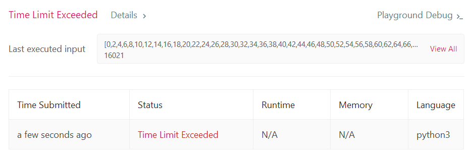
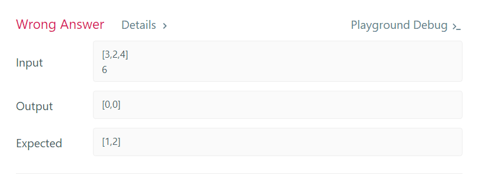
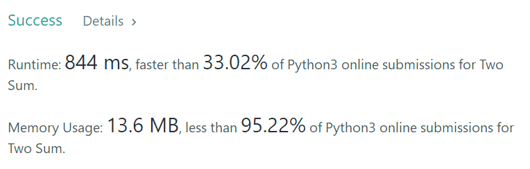
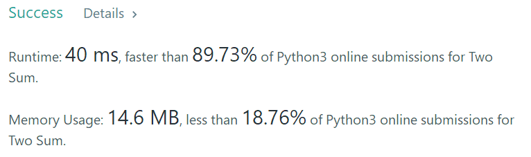
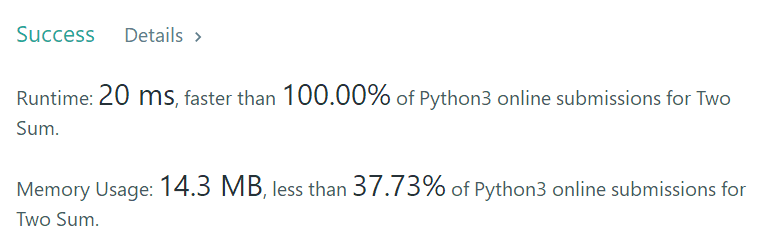

Given an array of integers, return indices of the two numbers such that they add up to a specific target.

You may assume that each input would have exactly one solution, and you may not use the same element twice.

**Example:**

```
Given nums = [2, 7, 11, 15], target = 9,

Because nums[0] + nums[1] = 2 + 7 = 9,
return [0, 1].
```


给定一个整数数组 `nums` 和一个目标值 `target`，请你在该数组中找出和为目标值的那 **两个** 整数，并返回他们的数组下标。

你可以假设每种输入只会对应一个答案。但是，你不能重复利用这个数组中同样的元素。

**示例:**

```
给定 nums = [2, 7, 11, 15], target = 9

因为 nums[0] + nums[1] = 2 + 7 = 9
所以返回 [0, 1]
```


```python
class Solution:
    def twoSum(self, nums: List[int], target: int) -> List[int]:
        for i in range(len(nums)):
            for j in range(len(nums)):
                if i==j:
                    continue;
                else:
                    if nums[i]+nums[j]==target:
                        list=[i,j]
                        return list;
```



一看就是循环太多了，复杂度太高，减小复杂度：

```python
class Solution:
    def twoSum(self, nums: List[int], target: int) -> List[int]:
        for i in range(len(nums)):
            if (target - nums[i]) in nums:
                return [i,nums.index(target - nums[i])];
```



[Python](https://blog.csdn.net/jh1137921986/article/details/82152168)提供的list.index(value,from,to) “左闭右开区间”，在不指定from,to的时候，该方法默认返回数组中第一次出现该value的index值，在case([3,4,2],6)中，应该输出[1,2]，而按照前面的思路，直接输出了[0,0]，

那就从这个数后面开始索引：

```
class Solution:
    def twoSum(self, nums: List[int], target: int) -> List[int]:
        for i in range(len(nums)):
            if (target - nums[i]) in nums[i+1:]:
                return [i,nums.index(target - nums[i], i+1)];
```



---

大佬的方法：

```python
class Solution:
    def twoSum(self, nums: List[int], target: int) -> List[int]:
        nums_dict = {}
        for i, num in enumerate(nums):
            if num in nums_dict:
                return [nums_dict[num],i]
            else:
                nums_dict[target-num] = i
```



最快的办法（减少了else语句）：

```python
class Solution(object):
    def twoSum(self, nums, target):
        h = {}
        for i, num in enumerate(nums):
            if (target - num) in h:
                return [i, h[target - num]]
            h[num] = i
```



---

>  enumerate的用法：
>         enumerate()是python的内置函数。对于一个可迭代的（iterable）/可遍历的对象（如列表、字符串），enumerate将其组成一个索引序列，利用它可以同时获得索引和值
>         例如：
>         list1 = ["这", "是", "一个", "测试"]
>         for index, item in enumerate(list1):
>         print index, item
>         >>>
>         0 这
>         1 是
>         2 一个
>         3 测试

