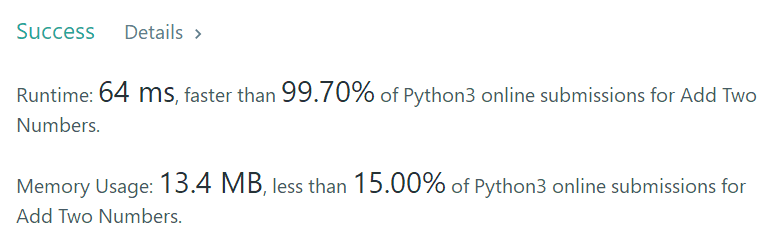
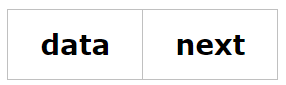

2. Add Two Numbers

Medium

You are given two **non-empty** linked lists representing two non-negative integers. The digits are stored in **reverse order** and each of their nodes contain a single digit. Add the two numbers and return it as a linked list.

You may assume the two numbers do not contain any leading zero, except the number 0 itself.

**Example:**

```
Input: (2 -> 4 -> 3) + (5 -> 6 -> 4)
Output: 7 -> 0 -> 8
Explanation: 342 + 465 = 807.
```


[小姐姐的答案](https://www.bilibili.com/video/av45954253?from=search&seid=9188058253674934973)

```python
# Definition for singly-linked list.
# class ListNode:
#     def __init__(self, x):
#         self.val = x
#         self.next = None

class Solution:
    def addTwoNumbers(self, l1: ListNode, l2: ListNode) -> ListNode:
        if l1==None:
            return l2
        if l2==None:
            return l1
        carry = 0
        dummy = ListNode(0)
        p = dummy
        
        while l1 and l2:
            p.next = ListNode((l1.val + l2.val + carry) % 10)
            carry =(l1.val + l2.val + carry) // 10
            l1=l1.next
            l2=l2.next
            p=p.next
        if l2:
            while l2:
                p.next = ListNode((l2.val + carry)% 10)
                carry =(l2.val + carry) // 10
                l2=l2.next
                p=p.next
        if l1:
            while l1:
                p.next = ListNode((l1.val + carry)% 10)
                carry =(l1.val + carry) // 10
                l1=l1.next
                p=p.next
        if carry == 1:
            p.next = ListNode(1)
        return dummy.next
```



主要是几点

- 考虑两个链表是否非空
- 考虑某个链表结束，另一个要继续
- 链表的基本操作，一会总结

[链表结构](https://blog.csdn.net/weixin_37728031/article/details/81145258)     [python链表操作](https://blog.csdn.net/su_bao/article/details/81065746)

链表的定义：

​	数据结构是计算机科学必须掌握的一门学问，很多的教材都是用C语言实现链表，因为C有指针，可以很方便的控制内存，很方便就实现链表，其他的语言，则没那么方便，有很多都是用模拟链表，**因为python是动态语言，可以直接把对象赋值给新的变量。**在C/C++中，通常采用“指针+结构体”来实现链表；**而在Python中，则可以采用“引用+类”来实现链表。**

链表的定义：是一组数据项的集合，其中每个数据项都是一个节点的一部分，每个节点还包含指向下一个节点的链接

链表的结构：data为自定义的数据，next为下一个节点的地址。



1. 初始化

```python
class Node(object):
    def __init__(self, data, next=None):
        self.data = data
        self.next = next
```

2. 用循环创建一个链表结构，并且访问其中的每一个节点

```python
head = None
for count in range(1,6):
	head = Node(count, head)
while head != None:
    print(head.data)
    head = head.next
```

3. 遍历使用一个临时的指针变量，这个变量先初始化为链表结构的head指针，然后控制一个循环。

```python
probe = head
while probe != None:
	probe = probe.next
```

4. 搜索： 有两个终止条件：
    一、空链表，不再有要检查的数据。
    二、目标项等于数据项，成功找到。

```python
probe = head
while probe != None and targetItem != probe.data:
    probe = probe.next
if probe != None:
    print("target is found")
else:
    print("target is not in this linked structure")
```

5. 访问链表中的第i（index）项

```python
probe = head
while index > 0:
    probe = probe.next
    index -= 1
print(probe.data)
```

6. 替换： 若目标项不存在，则返回False；否则替换相应的项，并返回True.

```python
probe = head
while probe != None and targetItem != probe.data:
    probe = probe.next
if probe != None:
    probe.data = newItem
    return True
else:
    return False
```

7. 在开始处插入

```python
head = Node(newItem, head)
```

8. 在末尾处插入： 在单链表末尾插入一项必须考虑两点：
    一、head指针为None，此时，将head指针设置为新的节点
    二、head不为None，此时代码将搜索最后一个节点，并将其next指针指向新的节点。

```python
newNode = Node(newItem)
if head is None:
    head = newItem
else:
    probe = head
    while probe.next != None:
        probe = probe.next
    probe.next = newNode
```


9 .从开始处删除

```python
head = head.next
```

10. 从末尾删除：  需要考虑两种情况：
    一、只有一个节点，head指针设置为None
    二、在最后一个节点之前没有节点，只需要倒数第二个节点的next指向None即可。

```python
if head.next is None:
    head = None
else:
    probe = head
    while probe.next.next != None:
        probe = probe.next
    probe.next = None
```

11. 在任何位置插入

   需要考虑两种情况：
   一、该节点的next指针为None。这意味着，i>=n，因此，应该将新的项放在链表结构的末尾。
   二、该节点的next指针不为None，这意味着，0<i<n，因此需将新的项放在i-1和i之间。

```python
if head is None or index <=0:
    head =Node(newItem, head)
else:
    probe = head
    while index > 1 and probe.next != None:
        probe = probe.next
        index -= 1
    probe.next = Node(newItem, probe.next)
```

12. 在任意位置删除

   一、i<= 0——使用删除第一项的代码
   二、0<i<n——搜索位于i-1位置的节点，删除其后面的节点
   三、i>n——删除最后一个节点

```python
if index <= 0 or head.next is None:
    head = head.next
else:
    probe = head
    while index > 1 and probe.next.next != None:
        probe = probe.next
        index -= 1
    probe.next = probe.next.next
```

