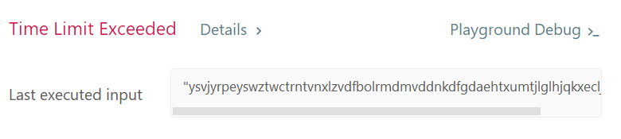
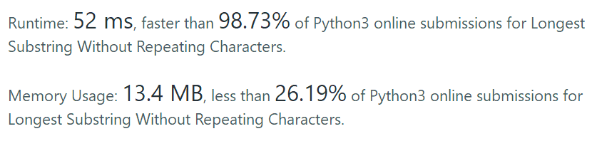

3. longest substring without repeating characters

Given a string, find the length of the **longest substring** without repeating characters.

**Example 1:**

```
Input: "abcabcbb"
Output: 3 
Explanation: The answer is "abc", with the length of 3. 
```

**Example 2:**

```
Input: "bbbbb"
Output: 1
Explanation: The answer is "b", with the length of 1.
```

**Example 3:**

```
Input: "pwwkew"
Output: 3
Explanation: The answer is "wke", with the length of 3. 
             Note that the answer must be a substring, "pwke" is a subsequence and not a substring.
```

我的结果：思路是将字符串切片，使用循环判断子串的重复性

```python
class Solution:
    def lengthOfLongestSubstring(self, s: str) -> int:
        if len(s) == 0:
            return 0
        if len(s) == 1:
            return 1
        for i in range(0,len(s)+1):
            for j in range(0,i+1):
                for x in s[j:i]:
                    if s[j:i].count(x) > 1:
                        value = 1
                if value == 0:
                    length = max(len(s[j:i]), length)
                value = 0
        return length
```



长结果时超时。

小姐姐的答案：

思路是使用字典，将索引存储在字典的value中

```python
class Solution:
    def lengthOfLongestSubstring(self, s: str) -> int:
        start = -1
        max = 0 
        d = {}
        for i in range(len(s)):
            if  s[i] in d and d[s[i]] > start:
                start = d[s[i]]
                d[s[i]] = i
            else:
                d[s[i]] = i
                if i - start > max:
                    max = i - start
        return max
```




