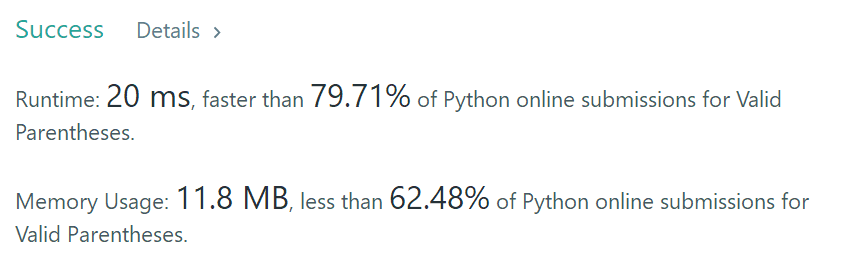
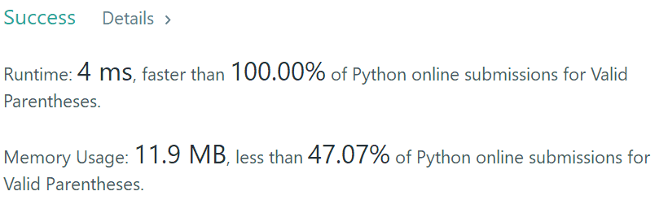

Given a string containing just the characters `'('`, `')'`, `'{'`, `'}'`, `'['` and `']'`, determine if the input string is valid.

An input string is valid if:

1. Open brackets must be closed by the same type of brackets.
2. Open brackets must be closed in the correct order.

Note that an empty string is also considered valid.

**Example 1:**

```
Input: "()"
Output: true
```

**Example 2:**

```
Input: "()[]{}"
Output: true
```

**Example 3:**

```
Input: "(]"
Output: false
```

**Example 4:**

```
Input: "([)]"
Output: false
```

**Example 5:**

```
Input: "{[]}"
Output: true
```


第一个答案：使用栈来压括号，有匹配取出，最后看字符串长度

```python
class Solution(object):
    def isValid(self, s):
        """
        :type s: str
        :rtype: bool
        """
        stack = []
        flag = 0
        for item in s:
            if len(stack) == 0:
                stack.append(item)
            else:
                if item == "}" and stack[len(stack)-1] == "{":
                    stack.pop()
                    flag = 1
                if item == "]" and stack[len(stack)-1] == "[":
                    stack.pop()
                    flag = 1
                if item == ")" and stack[len(stack)-1] == "(":
                    stack.pop()
                    flag = 1
                if flag == 0:
                    stack.append(item)
                flag = 0
        if len(stack) == 0:
            return True
        else:
            return False
```



参考更好的答案：

```python
class Solution(object):
    def isValid(self, s):
        stack = []
        paren_map = {')': '(',']': '[', '}': '{'}
        for c in s:
            if c not in paren_map:
                stack.append(c)
            elif not stack or paren_map[c] !=stack.pop():
                return False
        return not stack
```



