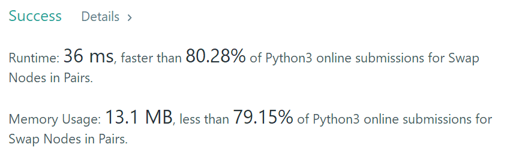

Given a linked list, swap every two adjacent nodes and return its head.

You may **not** modify the values in the list's nodes, only nodes itself may be changed.

 

**Example:**

```
Given 1->2->3->4, you should return the list as 2->1->4->3.
```

```python
# Definition for singly-linked list.
# class ListNode:
#     def __init__(self, x):
#         self.val = x
#         self.next = None

class Solution:
    def swapPairs(self, head: ListNode) -> ListNode:
        cur = self
        cur.next = head
        while cur.next and cur.next.next:
            a = cur.next
            b = a.next
            cur.next, b.next, a.next = b, a, b.next
            cur = a
        return self.next
        
```



