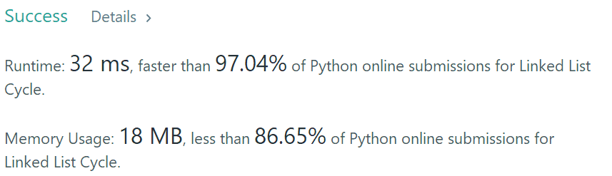

Given a linked list, determine if it has a cycle in it.

To represent a cycle in the given linked list, we use an integer `pos` which represents the position (0-indexed) in the linked list where tail connects to. If `pos` is `-1`, then there is no cycle in the linked list.

 

**Example 1:**

```
Input: head = [3,2,0,-4], pos = 1
Output: true
Explanation: There is a cycle in the linked list, where tail connects to the second node.
```


**Example 2:**

```
Input: head = [1,2], pos = 0
Output: true
Explanation: There is a cycle in the linked list, where tail connects to the first node.
```


**Example 3:**

```
Input: head = [1], pos = -1
Output: false
Explanation: There is no cycle in the linked list.
```


 

**Follow up:**

Can you solve it using *O(1)* (i.e. constant) memory?


#### 硬算

```python
# Definition for singly-linked list.
# class ListNode(object):
#     def __init__(self, x):
#         self.val = x
#         self.next = None
class Solution(object):
    def hasCycle(self, head):
        """
        :type head: ListNode
        :rtype: bool
        """
        flag = True
        ListNode = head
        for x in range(10000):
            if ListNode:
                pass
            else:
                flag = False
                break
            ListNode = ListNode.next
        return flag     
        
```


#### 利用集合判断

```python
# Definition for singly-linked list.
# class ListNode(object):
#     def __init__(self, x):
#         self.val = x
#         self.next = None
class Solution(object):
    def hasCycle(self, head):
        """
        :type head: ListNode
        :rtype: bool
        """
        s = set()
        flag = False
        ListNode = head
        while True:
            if ListNode:
                if ListNode in s:
                    flag = True
                    break
                s.add(ListNode)
            else:
                break
            ListNode = ListNode.next
        return flag
        
```


#### 快慢指针

```python
# Definition for singly-linked list.
# class ListNode(object):
#     def __init__(self, x):
#         self.val = x
#         self.next = None
class Solution(object):
    def hasCycle(self, head):
        """
        :type head: ListNode
        :rtype: bool
        """
        fast = slow = head
        while fast and slow and fast.next:
            slow = slow.next
            fast = fast.next.next
            if slow == fast:
                return True
        return False
```



