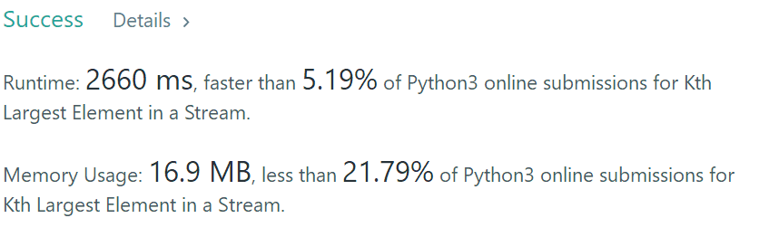
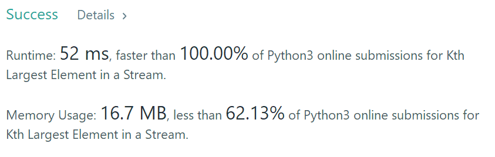

Design a class to find the **k**th largest element in a stream. Note that it is the kth largest element in the sorted order, not the kth distinct element.

Your `KthLargest` class will have a constructor which accepts an integer `k` and an integer array `nums`, which contains initial elements from the stream. For each call to the method `KthLargest.add`, return the element representing the kth largest element in the stream.

**Example:**

```
int k = 3;
int[] arr = [4,5,8,2];
KthLargest kthLargest = new KthLargest(3, arr);
kthLargest.add(3);   // returns 4
kthLargest.add(5);   // returns 5
kthLargest.add(10);  // returns 5
kthLargest.add(9);   // returns 8
kthLargest.add(4);   // returns 8
```

**Note:** 
You may assume that `nums`' length ≥ `k-1` and `k` ≥ 1.

最笨的办法：每次都排序，得到结果：

```python
class KthLargest:

    def __init__(self, k: int, nums: List[int]):
        self.k = k
        self.nums = nums
        
    def add(self, val: int) -> int:
        self.nums.append(val)
        self.nums.sort(reverse = True)
        return self.nums[self.k-1]
        
```



推排序：时间复杂度降低：使用heapq模块

``` python
class KthLargest(object):
 
    
    def __init__(self, k, nums):
        self.pool = nums
        self.k = k
        heapq.heapify(self.pool)
        while len(self.pool) > k:
            heapq.heappop(self.pool)

            
    def add(self, val):
        if len(self.pool) < self.k:
            heapq.heappush(self.pool, val)
        elif val > self.pool[0]:
            heapq.heapreplace(self.pool, val)
        return self.pool[0]
```



python的库还是秀啊

[heapq模块](https://www.jianshu.com/p/801318c77ab5)

