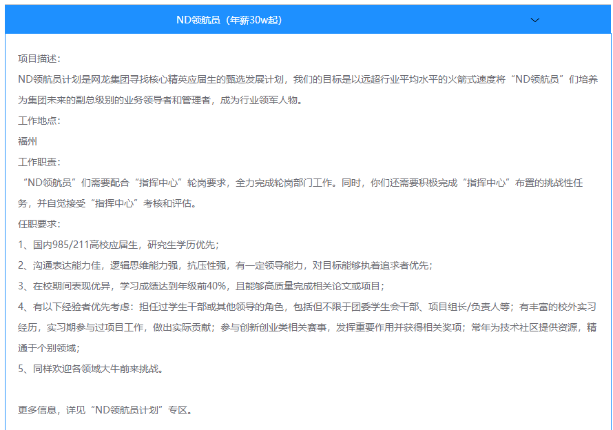
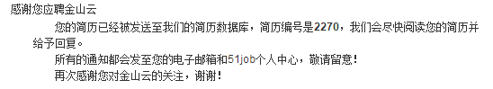
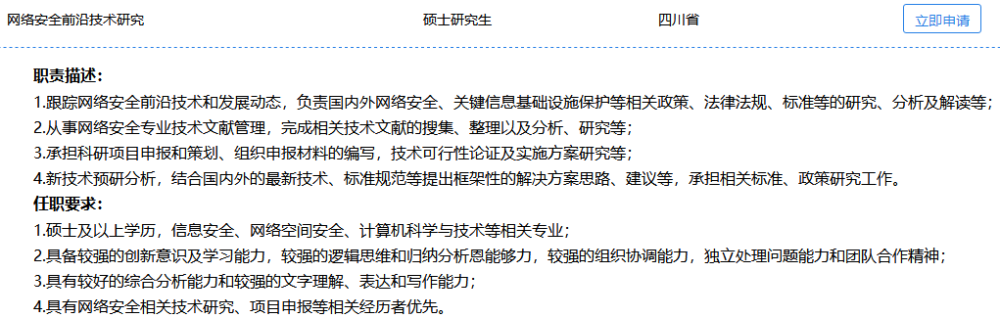
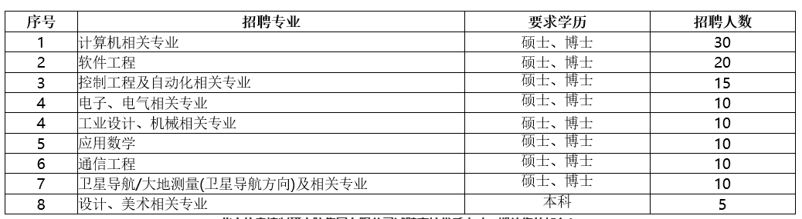

[TOC]

### 上岸中

#### 8.7：中兴

- 8.7 维护简历，志愿分别是网络安全工程师、技术预研工程师、信息安全经理，未提交

- ```
  主要方向：安全测评、安全治理、工具研发、网络通讯管理
  ```

- 8.16 打电话催促提交，在火车上，承诺今天提交。交了

- 8.25 笔试，第一志愿不在列表，可能不需要笔试

- 9.7 面试，面的没啥，主要聊项目部门是无线测试

- 9.8 面试，压力面。

- 9.16 打电话通知，定部门，准备签约洽谈

### 进行中

#### 6.12：中国邮政储蓄银行

- [软件研发中心：信息技术类](https://xiaoyuan.zhaopin.com/job/CC000106039J90000239000)：成都
- 6.12 简历提交
- 8.15 提示8.27笔试
- 8.27 14：00-16：30 陕西万达职业技能培训学校 现场笔试
- 9.13 邀请面试短信：9.21 成都面试
- 9.17 打电话调西安面试
- 9.21 西安面试

#### 6.13：字节跳动

- [游戏测试开发工程师](https://job.bytedance.com/user/profile/)：杭州
- 6.13 简历提交
- 6.30 笔试
- 7.11 凉
- 9.12 投递[安全工程师](https://job.bytedance.com/job/detail/45614)
- 
- 9.19 视频面试（下午两点）

#### 7.11：上海浦发银行

- 7.11 （提前批）简历提交&在线测评

  > 两次面试一次笔试，笔试客观题，面试有一次上机，三道编程

- 提前批确认已凉

- 9.17 正式批再来一次

- ```
  职责简述
  负责网络安全扫描渗透和攻防、安全事件监测分析和处置，信息安全管理和安全内控检查，开发安全管理，数据安全管理，外包管理，安全工具研发，安全设备和系统选型和部署工作。
  应聘基本条件
  1、全日制高等院校应届毕业生;
  境内高校学生为2020.1.1-2020.12.31期间毕业，
  境外高校学生为2019.1.1-2020.12.31期间毕业。
  2、本科及以上学历。
  3、以计算机与信息技术、大数据挖掘、软件工程、人工智能、金融工程、统计学等理工科专业为主。
  4、品行端正、学业优良、身心健康。
  5、外语水平、计算机应用能力出色。
  6、开拓进取，勇于创新，具备高度的责任心和敬业精神。
  ```

- 9.19 正式批测评

#### 7.22：华为

- 6.12 海思交流会（博士）
- 7.17 联系内推，服务与软件研发管理部
- 7.22 投简历：网络安全工程师
- 7.24 在线测评（美右）
- 7.31 笔试（三个都没AC，1是25%，2是73%）
- 
- 
- 9.12 发短信面试推迟
- 9.21面试

#### 7.31：网易

- 7.31 联系内推码，安全工程师（研究院）+游戏运维工程师（网易雷火）+游戏安全工程师（网易互娱）
- 8.1 完成测评
- 8.3 15：00笔试（安全工程师）
- 8.12 说是有人面了，可能凉了，查公众号确实凉了（安全工程师）
- 9.15 14：00笔试（游戏运维工程师）


#### 8.20：途家民宿

- 8.20 提交简历：测试工程师
- 
- 9.6 在线笔试（做得不好，第二题不能用python？）

#### 8.21：海康威视

- 8.21 提交简历：安全研发工程师，技术支持
- 8.21 完成测评
- **3VHQA5**
- 


#### 8.28：大华

- 8.28 内推网络安全工程师（简历没写docker）
- 

#### 8.28：网龙

- 
- 8.28 试试领航员计划
- 8.31 完成测评

#### 8.28：交通银行

- ```
  1.系统管理方向
  (1)参与大型机系统、开放系统的规划、配置、系统层资源调整；生产及灾备系统环境建设，提供性能优化建议与解决方案。
  (2)参与数据中心最新前沿技术研究、应用系统的系统层架构设计。
  (3)参与IaaS云计算设计，推进云框架下的技术落地。
  2.网络管理方向
  (1)参与网络系统的规划、配置、运维管理、性能调优。
  (2)参与分析解决网络运行中问题，参与数据中心最新前沿技术研究。
  3.设备管理方向
  (1) 参与实施数据中心计算机设备的生命周期管理。参与生产设备的上线、巡检、监控、分析规划。参与数据中心生产及灾备系统环境建设。
  (2)参与分析解决设备运行中的问题，提供性能优化建议与解决方案。
  4.安全管理方向
  (1)参与制定与维护安全总体策略、安全制度、安全规范、技术防范要求和标准。
  (2) 组织信息安全风险评估工作，建立和维护信息安全风险的标准，对各类信息安全风险进行识别、分析、评估和处置。
  (3)完成安全攻击行为的发现方法、安全攻击全流程分析梳理、安全攻击漏洞定位、安全防御措施的落实及常见的网络安全攻击分析。
  (4)参与系统软硬件、网络和应用的安全漏洞扫描和渗透测试。
  职位要求:
  (1)应届全日制本科及以上学历毕业生和初次就业的海外院校留学归国人员； 
  (2)计算机科学与技术、软件工程、电子通信、信息安全、信息管理、自动化、数学、物理学等相关专业；
  (3)英语四级；主课成绩优秀；
  (4)了解计算机操作系统，或了解中间件产品，或了解数据库的相关操作。或了解TCP/IP协议，掌握网络相关设备的配置技术，了解相关网络安全产品，如防火墙、IPS/IDS、内网威胁防护等。
  (5)熟悉计算机各领域的基础知识和原理；熟悉操作系统、数据结构等系统软件者优先；
  (6)积极参加校内活动、获得奖励者及学生干部优先。
  (7)具备良好的道德素养和团队协作精神，有强烈的责任心。身体健康，品行端正，诚实守信，无任何违规违纪行为；
  ```

  

- 8.28 投递岗位 

#### 9.4：金山云

- 9.4 投递

- 9.5 晚上宣讲笔试，第二天面试（去不了）
- 

#### 9.5：中国网安

- 宣讲：西电9.11日14：00北校区J605

- 中国电子科技网络信息安全有限公司1志愿：网络安全前沿技术研究

- 

#### 9.9：北方信息控制研究院

- [网址](http://campus.51job.com/bfxx2020/)

- 9.9 投递 简历编号1346

- 2019年9月9日                 19:00 - 20:30                           招聘地点：J-601


#### 9.9：招联金融

- 9.9 投递安全技术
- 

#### 9.12 中国银联

```
安全管理 上海市
工作描述: 
1.负责开展安全攻防测试和实战演练，挖掘互联网和APP端安全漏洞，开展信息安全事件、风险漏洞的分析和应急处置工作； 
2.负责参与国内外金融支付、信息安全等标准组织，跟踪分析信息安全技术、标准的最新进展，编制与修订金融行业、企业信息安全相关技术规范； 
3.负责制定公司信息安全技术发展规划，研究分析密码算法、网络安全、支付安全等最新技术发展，参与支付产品安全方案的设计工作； 
4.负责开展信息安全管理体系的实施和完善工作，组织制修订信息安全管理制度、规范，负责制定安全工作的计划，开展信息安全风险评估和内部安全检查工作。
职位要求: 
1.全日制大学本科及以上学历；信息安全、计算机等相关专业； 
2.熟悉个人信息保护等大数据相关法律和政策，或熟悉数据安全理论与实践；或熟悉数据管理理论与实践，具备SQL\HIVESQL等数据处理相关知识； 
3.具备较强的沟通协调能力、逻辑分析能力和学习研究能力； 
4.具备较强的文字写作能力； 
5.具备团队合作精神，有极强的责任心，擅于思考、肯钻研，有独立解决问题的能力，能够承担工作压力； 
6.具备学生干部经历、社会实践经历者优先。
```

- 9.12 投递

#### 9.12 东方财富

- 9.12 投递 [信息安全咨询师](https://eastmoney.zhiye.com/zpdetail/350284860)

- ```
  信息安全咨询师-2020秋招
  
  工作职责：
  1、参与信息安全体系建设；
  2、参与网信办、工信部、公安部等互联网行业监管机构相关要求的信息安全解读与对标，推动内部整改达到监管合规；
  3、参与完成ISO/IEC 27001、等级保护等安全标准认证合规；
  4、参与分/子公司的年度信息安全审计和其他专项信息安全审计。
  
  任职资格：
  1、全日制统招本科及以上学历，专业不限；
  2、熟悉监管机构相关监管要求，对信息安全相关行业标准有初步了解，对等级保护、ISO/IEC 27001有了解；
  2、沟通能力及主动学习能力强；
  3、熟悉软件应用，熟练office办公软件操作；
  4、具备一定的文档撰写能力，能够独立撰写评估报告。
  ```

#### 9.12 深信服

- 9.12 投递安全服务工程师
- 

#### 9.12 中国移动研究院

- 9.12 投递终端安全研究员

- ```
  工作内容/职位描述：
  从事下列工作之一： 
  1、负责移动终端、物联网等领域的安全解决方案研究，相关标准化推动； 
  2、负责移动终端、物联网等领域的安全评测与漏洞挖掘研究； 
  3、负责移动终端、物联网等领域的安全技术项目管理和技术研发； 
  
  任职要求：
  意向专业 
  计算机科学与技术、计算机应用、软件工程、密码学、网络安全、信息安全，及相关专业； 
  语言能力 
  有良好的英语听说读写能力； 
  技术要求 
  满足下列条件之一： 
  1、熟悉以下相关技术之一，信息安全、安全攻防、移动终端、大数据分析、物联网等相关技术； 
  2、了解Java、Python，了解面向对象的分析和设计技术，数据库技术； 
  3、具备一定的实验动手能力，能够利用Java和Python开发安全工具/脚本； 
  素质要求 
  1、积极、主动，有高度的责任心； 
  2、良好的沟通技巧和团队合作精神； 
  3、工作踏实认真，思路清晰，善于思考。 
  
  ```

  

#### 9.12 中电52所

- [官网](http://www.cethik.com/hrdet.aspx?c_kind=4&c_kind2=23&pageIndex=3&id=629)

- 9.12 投递信息安全工程师

- ```
  1、计算机类相关专业本科及以上学历；
  2、熟悉信息安全相关前沿技术和产品；熟悉计算机网络、网络安全，安全策略等相关知识；
  3、熟练掌握Office软件，具备良好的逻辑分析能力及沟通表达能力，善于编写各类技术文档；
  4、具有较强的工作计划性及执行能力，能够承受一定的工作压力，能够接受出差。
  ```


#### 9.17 平安科技

- 9.17 投递平安科技：安全工程师
- 
- 9.17 投递平安智慧城：智慧养老-IT项目经理
- 

#### 9.17：中国银行

- 9.17 投递
- 
- 
- 

#### 9.17：TP-link

- 9.17 投递 IT安全工程师

- ```
  岗位职责：
  1.	负责对企业IT信息系统架构（应用架构、数据架构和技术架构）进行安全风险分析，制订信息安全策略和解决方案，并推动实施和完善。
  2.	负责协助规划和制定公司信息安全策略、IT安全的解决方案，并推动实施。
  3.	负责制定公司内部信息安全等级保护策略和技术标准，防范有组织的黑客团体攻击以及内部信息泄露。
  4.	负责前沿IT技术（大数据、云计算和移动社交等技术）下的信息安全风险分析，制定针对性的安全策略和解决方案。
  5.	根据业务需求，定制云计算/数据中心安全解决方案。
  6.	根据业务需求设计高扩展性、高性能、安全稳定的安全防御系统。
  
  招聘要求：
  1.	本科及以上学历。
  2.	计算机、信息安全等相关专业。
  3.	能使用图示清楚地表达架构意图，对信息安全异常敏感，熟悉各种安全漏洞及渗透行为优先。
  4.	有很强的逻辑分析能力，善于总结和抽象提炼；有较强的沟通、协调能力；良好的文字表达能力。
  ```


#### 9.17：兆日科技

- 9.17 投递
- 9.19 一站式投递，西安没有安全岗位，放弃

### 感觉凉

#### 8.7：小米

- 8.7 内推，安全开发工程师
- 9.3 通知下午三点视频面试
- 
- 9.12 没消息，发邮件问一下

### 等批次

#### 5.23：上汽通用汽车武汉分公司 

- 计算机类
- 5.23 简历筛选通过
- 6.8 武汉面试
- 7.9 又约武汉面试，没去
- 8.1 又约8.7武汉面试，又没去
- 8.24 又约武汉面试，再没去


#### 7.31：陌陌

- 7.31 内推 数据安全工程师
- 
- 8.29 [进度连接](https://app.mokahr.com/m/candidate/applications/deliver-query/immomo)
- 

### 凉了

#### 14所

- | 岗位名称： | 1.05 测试研发工程师                                        |
  | ---------- | ---------------------------------------------------------- |
  | 岗位类别： | 技术研发类                                                 |
  | 学历要求： | 硕士及以上                                                 |
  | 岗位描述： | 从事模拟仿真、测试验证需求分析、可靠性预计等工作。         |
  | 岗位要求： | 电子类、通信类、控制类、自动化类、计算机类、仪器类等专业。 |

- 9.9投递

- 通知别人面了，应该是凉了

#### 一加

- 
- 9.5 投递内推
- 9.9 参加笔试
- 9.10 参加面试，没消息，应该是凉了

#### 心动网络（实习）

- 运维工程师
- 5.14 简历初选不合格

#### 贝壳找房

- 7.22 投简历：安全研发工程师
- 
- 8.10 笔试
- 8.11 在线测评
- 8.18 北京，现场面试（凉）

#### OPPO

- 6.21 简历提交
- 7.5 凉，正式批已经重新投了
- 宣讲会：北校区 J-114  2019年9月4日 19:00-20:30
- 9.8 双211收到笔试我没收到，凉。

#### 大疆

- 7.24 联系内推码，系统安全工程师（上海）
- 7.26 在线测评（很有意思）
- 8.4 19：00 笔试
- 8.12 有人收到笔试未通过通知
- 8.13 通知15日下午16：30电话面试
- 8.15 电话面试
- 8.20 一面挂

#### 360

- 8.1 内推提前批，安全工程师
- 
- 8.15 笔试
- 8.21 通知笔试没过
- 8.22 重新投递正式批
- 您的报名编号为`120910`请牢记您的报名编号，此编号在本次招聘的每一个环节都需要提供。
- 8.31 正式批笔试
- 9.6 正式批凉。

#### 空空导弹

- 9.4 投递简历，本周出结果
- 9.8 本周结束，胖虎有消息了，凉。

#### vivo

- 运维工程师
- 5.30 简历提交
- 6.4 笔试
- 未通过（状态：进入笔试）
- 8.20 状态：进入人才库
- 8.20 投递正式批：安全工程师 运维研发工程师
- 8.21 测评
- 9.11 通知下午笔试，没做，取舍了，凉
- 
- 

#### 平安普惠

- 8.20 提交简历：[安全](http://campus.pingan.com/positionDetail?positionId=8928f96fb41630fc8ddcb43958ef4f40)

- ```
  安全工程师（2020 届）
  
  岗位职责:
  
  （沙龙宣讲行程：广州 → 西安 → 哈尔滨 → 南京 → 上海。预计 9 月初开启，10 月下旬结束，请关注沙龙宣讲时间安排）
  ◆安全技术
  1、挖掘系统安全漏洞；
  2、提出业务安全需求；
  3、监管和汇报安全事件，对信息安全事件进行分析和改进。
  ◆安全运营
  1、安全风险的规则运营、监控和规则优化；
  2、安全事件的分析和跟踪，推进和提高信息安全监控体系的风险运营能力。
  ◆安全管理
  1、负责内部各类安全制度、流程及规范的制定、推广和优化；
  2、定期开展内部安全审计，及时发现安全问题，并积极跟进问题解决。
  任职要求:
  
  ◆安全技术
  1、本科及以上学历，信息安全相关专业；
  2、熟悉 web 漏洞检测、分析、防御原理和方法，掌握常见漏洞（SQL 注入、XSS、本地 / 远程文件包含、命令执行、木马上传）的 POC 及验证方法；
  3、对安全测试与代码分析有强烈的兴趣；
  4、具有 Java 或 Python 等高级语言编程基础；
  5、熟悉常用的安全扫描产品或渗透工具，如 Nmap、Nessus、Nikto、WVS 等，利用他们进行漏洞挖掘。
  ◆安全运营
  1、本科及以上学历，信息安全相关专业；
  2、具有一定的信息安全理论基础，熟悉 windows/Linux 等操作系统；
  3、具备良好的数据分析统计、事件调查分析能力；
  4、具有 Python 等脚本编程基础；
  5、拥有良好的协调沟通能力。
  ◆安全管理
  1、本科及以上学历，信息安全相关专业；
  2、良好的文档编写能力，熟悉使用 OFFICE 套件，包括但不限于 Word、Excel、PPT、VISIO；
  3、熟悉信息安全相关的法律法规、国际 / 国家标准，如 ISO27001、等级保护要求；
  4、拥有良好的协调沟通能力。
  ```

  

- 9.5 拉进群了，晚上做了测评（测评是有各种IQ题的）

- 9.11 校园沙龙 西安皇后大酒店 一点半签到

- 快速面试，直接怼炸。

#### 兴业银行

- 8.29 投递科技金融类岗位
- 
- 9.11 宣讲+笔试，（java+oracle）凉

#### 顺丰

- 8.7 内推，信息安全工程师（提前批，免笔试）

- 8.22 完成测评。

- 

- 8.29 在线考试:信息安全方向职位

  ```
  笔试很全面，从数据结构计算机网络到安全全都有，偏渗透，编程一个，A了90%
  ```

- 笔试之后没消息，官网已经没有安全岗位，默认凉。

#### 绿盟

- 宣讲
- 9.7 投递简历：创新研究员（大佬说地方可以谈）
- 简历编号 2605
- 9.7 完成测评
- 9.8 线下笔试 诡异 瞎写了一些
- 
- 9.11 没怎么做笔试的收到面试邀请，应该凉了

#### 207所

- 9.10 投递加一面
- 9.11 联系hr无果，默认凉

#### 卫士通


- 9.5 投递简历
- 9.11有人收到电话，没收到，可能凉
- 9.12 不死心，再投了一下

#### 美团

- 9.16 一站式投递面试，倒在二面
