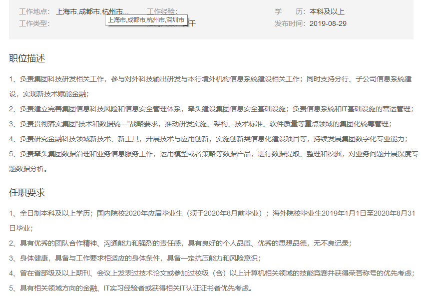

[TOC]


### 凉了

#### 4.23：心动网络（实习）

- 运维工程师
- 5.14 简历初选不合格

#### 7.22：贝壳找房

- 7.22 投简历：安全研发工程师
- 
- 8.10 笔试
- 8.11 在线测评
- 8.18 北京，现场面试（凉）

#### 7.24：大疆

- 7.24 联系内推码，系统安全工程师（上海）
- 7.26 在线测评（很有意思）
- 8.4 19：00 笔试
- 8.12 有人收到笔试未通过通知
- 8.13 通知15日下午16：30电话面试
- 8.15 电话面试
- 8.20 一面挂

#### 8.1：360

- 8.1 内推提前批，安全工程师
- 
- 8.15 笔试
- 8.21 通知笔试没过
- 8.22 重新投递正式批
- 您的报名编号为`120910`请牢记您的报名编号，此编号在本次招聘的每一个环节都需要提供。
- 8.31 正式批笔试
- 9.6 正式批凉。

### 进行中


#### 5.23：上汽通用汽车武汉分公司 

- 计算机类
- 5.23 简历筛选通过
- 6.8 武汉面试
- 7.9 又约武汉面试，没去
- 8.1 又约8.7武汉面试，又没去
- 8.24 又约武汉面试，再没去

#### 5.30：vivo

- 运维工程师
- 5.30 简历提交
- 6.4 笔试
- 未通过（状态：进入笔试）
- 8.20 状态：进入人才库
- 8.20 投递正式批：安全工程师 运维研发工程师
- 8.21 测评
- 
- 

#### 6.12：中国邮政储蓄银行

- [软件研发中心：信息技术类](https://xiaoyuan.zhaopin.com/job/CC000106039J90000239000)：成都
- 6.12 简历提交
- 8.15 提示8.27笔试
- 8.27 14：00-16：30 陕西万达职业技能培训学校 现场笔试

#### 6.13：字节跳动

- [游戏测试开发工程师](https://job.bytedance.com/user/profile/)：杭州
- 6.13 简历提交
- 6.30 笔试
- 7.11 凉

#### 6.21：OPPO

- 6.21 简历提交
- 7.5 凉，正式批已经重新投了
- 宣讲会：北校区 J-114  2019年9月4日 19:00-20:30

#### 7.11：上海浦发银行

- 7.11 （提前批）简历提交&在线测评

  > 两次面试一次笔试，笔试客观题，面试有一次上机，三道编程
  
- 提前批确认已凉

#### 7.22：华为

- 6.12 海思交流会（博士）
- 7.17 联系内推，服务与软件研发管理部
- 7.22 投简历：网络安全工程师
- 7.24 在线测评（美右）
- 7.31 笔试（三个都没AC，1是25%，2是73%）
- 
- 

#### 7.31：网易

- 7.31 联系内推码，安全工程师（研究院）+游戏运维工程师（网易雷火）+游戏安全工程师（网易互娱）
- 8.1 完成测评
- 8.3 15：00笔试（安全工程师）
- 8.12 说是有人面了，可能凉了，查公众号确实凉了（安全工程师）

#### 7.31：陌陌

- 7.31 内推 数据安全工程师
- 
- 8.29 [进度连接](https://app.mokahr.com/m/candidate/applications/deliver-query/immomo)
- 

#### 7.31：西安国际医学中心

- 7.31 简历提交

- 

#### 8.7：小米

- 8.7 内推，安全开发工程师

- 9.3 通知下午三点视频面试

  

- 

#### 8.7：顺丰

- 8.7 内推，信息安全工程师（提前批，免笔试）

- 8.22 完成测评。

- 

- 8.29 在线考试:信息安全方向职位

  ```
  笔试很全面，从数据结构计算机网络到安全全都有，偏渗透，编程一个，A了90%
  ```
  
  

#### 8.7：中兴

- 8.7 维护简历，志愿分别是网络安全工程师、技术预研工程师、信息安全经理，未提交

- ```
  主要职责
  安全测评
  1、负责产品的网络安全测评、漏洞挖掘和验证；
  2、负责产品安全的供应链业务、产品交付过程改进、跟踪、协调；
  3、支持公司审计部门进行产品安全工作的审计；
  4、攻防技术和工具的研究和应用；
  5、负责各类安全工具在公司内的推广，包括培训、安装调试、故障排查、技术支持；
  6、公司产品安全漏洞的挖掘和验证；
  7、安全工具的挖掘和二次开发，工具使用手册等支持文档的编写。
  
  安全治理
  1、推进产品安全的规范化运作流程实施；
  2、组织和协调业务单位实现安全保证的改进与提升；
  3、推动公司各单位产品安全技能的提升和知识共享；
  4、对安全事件进行日常跟踪和管理；
  5、研究行业技术标准和最佳实践；
  6、分析和应答客户的安全需求。
  
  工具研发
  1、负责安全工具的探索、二次开发及安全技术的内外部合作交流等；
  2、通过独立测评等方式检查及推进安全编码规范、安全策略等在产品侧的落地；
  3、处理产品提交的安全漏洞分析申请，并给予产品技术指导；
  4、通过文档输出、培训等方式，进行安全工具知识、技能的传递。 
  
  网络通讯管理
  1、负责网络系统整体规划与建设；
  2、负责网络系统日常管理和维护，保证网络系统正常运行；       
  3、负责安全策略规划和落地实施。
  
  任职要求
  安全测评
  1、电子、通信、计算机、信号处理、自动控制、模式识别等相关专业本科及以上学历；
  2、熟练掌握Windows/Linux/Unix操作系统、数据库基础知识；
  3、熟悉常见的网络协议（如TCP/IP、HTTP/HTTPS、DHCP等）；
  4、熟练掌握一门开发语言（如Java、C/C++、Python、Perl等）；
  5、具备一定的安全基础知识，了解常见的安全漏洞和隐患；
  6、熟悉常用安全测试工具或具备一定安全编码检查能力者佳；
  7、有较好的学习能力、沟通协调能力和文档编写能力。
  
  安全治理
  1、电子、通信、计算机等相关专业本科及以上学历；  
  2、具备通信网络及安全基础知识，熟悉office系列常用办公软件；
  3、必须具备以下两项以上技能：
  （1）组织、策划与协调能力突出
  （2）熟悉网络新媒体，善于传递资讯、聚集关注度
  （3）口头及书面表达能力突出
  4、学习能力强，心态积极主动，工作有责任心。
  
  工具研发
  1、工作积极主动，具有较强的探索精神，且对主流的安全扫描工具有一定的了解；
  2、熟练掌握主流操作系统、数据库、Web框架等基础知识，熟悉常见的网络协议；
  3、熟悉常见的安全漏洞原理及其风险，并具备分析验证能力；
  4、拥有3年以上C/C++、Java或Python的开发经验，具备安全编码审计能力者优先；
  5、具有较强的学习能力、沟通协调能力和文档输出能力。
  
  网络通讯管理
  1、网络、通讯或计算机及相关专业本科及以上学历；
  2、了解网络通讯拓扑及相关产品技术，掌握ITIL基本理论，熟悉网络通讯运维相关制度；
  3、良好的沟通和服务意识，责任心强；
  4、具备网络通讯系统及安全设备综合管理实习经验者优先考虑。
  
  ```

- 8.16 打电话催促提交，在火车上，承诺今天提交。交了

- 8.25 笔试，第一志愿不在列表，可能不需要笔试

- 9.7 面试，面的没啥，主要聊项目部门是无线测试

#### 8.20：平安普惠

- 8.20 提交简历：[安全](http://campus.pingan.com/positionDetail?positionId=8928f96fb41630fc8ddcb43958ef4f40)

- ```
  安全工程师（2020 届）
  
  岗位职责:
  
  （沙龙宣讲行程：广州 → 西安 → 哈尔滨 → 南京 → 上海。预计 9 月初开启，10 月下旬结束，请关注沙龙宣讲时间安排）
  ◆安全技术
  1、挖掘系统安全漏洞；
  2、提出业务安全需求；
  3、监管和汇报安全事件，对信息安全事件进行分析和改进。
  ◆安全运营
  1、安全风险的规则运营、监控和规则优化；
  2、安全事件的分析和跟踪，推进和提高信息安全监控体系的风险运营能力。
  ◆安全管理
  1、负责内部各类安全制度、流程及规范的制定、推广和优化；
  2、定期开展内部安全审计，及时发现安全问题，并积极跟进问题解决。
  任职要求:
  
  ◆安全技术
  1、本科及以上学历，信息安全相关专业；
  2、熟悉 web 漏洞检测、分析、防御原理和方法，掌握常见漏洞（SQL 注入、XSS、本地 / 远程文件包含、命令执行、木马上传）的 POC 及验证方法；
  3、对安全测试与代码分析有强烈的兴趣；
  4、具有 Java 或 Python 等高级语言编程基础；
  5、熟悉常用的安全扫描产品或渗透工具，如 Nmap、Nessus、Nikto、WVS 等，利用他们进行漏洞挖掘。
  ◆安全运营
  1、本科及以上学历，信息安全相关专业；
  2、具有一定的信息安全理论基础，熟悉 windows/Linux 等操作系统；
  3、具备良好的数据分析统计、事件调查分析能力；
  4、具有 Python 等脚本编程基础；
  5、拥有良好的协调沟通能力。
  ◆安全管理
  1、本科及以上学历，信息安全相关专业；
  2、良好的文档编写能力，熟悉使用 OFFICE 套件，包括但不限于 Word、Excel、PPT、VISIO；
  3、熟悉信息安全相关的法律法规、国际 / 国家标准，如 ISO27001、等级保护要求；
  4、拥有良好的协调沟通能力。
  ```

  

- 9.5 拉进群了，晚上做了测评（测评是有各种IQ题的）

- 9.11 校园沙龙 西安皇后大酒店 一点半签到

- 

#### 8.20：途家民宿

- 8.20 提交简历：测试工程师
- 
- 9.6 在线笔试

#### 8.21：海康威视

- 8.21 提交简历：安全研发工程师，技术支持
- 8.21 完成测评
- **3VHQA5**
- 


#### 8.28：大华

- 8.28 内推网络安全工程师（简历没写docker）
- 

#### 8.28：网龙

- 
- 8.28 试试领航员计划
- 8.31 完成测评

#### 8.28：交通银行

- ```
  1.系统管理方向
  (1)参与大型机系统、开放系统的规划、配置、系统层资源调整；生产及灾备系统环境建设，提供性能优化建议与解决方案。
  (2)参与数据中心最新前沿技术研究、应用系统的系统层架构设计。
  (3)参与IaaS云计算设计，推进云框架下的技术落地。
  2.网络管理方向
  (1)参与网络系统的规划、配置、运维管理、性能调优。
  (2)参与分析解决网络运行中问题，参与数据中心最新前沿技术研究。
  3.设备管理方向
  (1) 参与实施数据中心计算机设备的生命周期管理。参与生产设备的上线、巡检、监控、分析规划。参与数据中心生产及灾备系统环境建设。
  (2)参与分析解决设备运行中的问题，提供性能优化建议与解决方案。
  4.安全管理方向
  (1)参与制定与维护安全总体策略、安全制度、安全规范、技术防范要求和标准。
  (2) 组织信息安全风险评估工作，建立和维护信息安全风险的标准，对各类信息安全风险进行识别、分析、评估和处置。
  (3)完成安全攻击行为的发现方法、安全攻击全流程分析梳理、安全攻击漏洞定位、安全防御措施的落实及常见的网络安全攻击分析。
  (4)参与系统软硬件、网络和应用的安全漏洞扫描和渗透测试。
  职位要求:
  (1)应届全日制本科及以上学历毕业生和初次就业的海外院校留学归国人员； 
  (2)计算机科学与技术、软件工程、电子通信、信息安全、信息管理、自动化、数学、物理学等相关专业；
  (3)英语四级；主课成绩优秀；
  (4)了解计算机操作系统，或了解中间件产品，或了解数据库的相关操作。或了解TCP/IP协议，掌握网络相关设备的配置技术，了解相关网络安全产品，如防火墙、IPS/IDS、内网威胁防护等。
  (5)熟悉计算机各领域的基础知识和原理；熟悉操作系统、数据结构等系统软件者优先；
  (6)积极参加校内活动、获得奖励者及学生干部优先。
  (7)具备良好的道德素养和团队协作精神，有强烈的责任心。身体健康，品行端正，诚实守信，无任何违规违纪行为；
  ```

  

- 8.28 投递岗位 

#### 8.29：兴业银行

- 8.29 投递科技金融类岗位
- 

#### 9.4：金山云

- 9.4 投递

- 9.5 晚上宣讲笔试，第二天面试（去不了）
- 

#### 9.5：中国网安

- 宣讲：西电9.11日14：00北校区J605
- 中国电子科技网络信息安全有限公司1志愿：网络安全前沿技术研究
- 

#### 9.5：卫士通


- 9.5 投递简历

#### 9.5：绿盟

- 宣讲
- 9.7 投递简历：创新研究员（大佬说地方可以谈）
- 9.7 完成测评
- 

#### 9.5：一加

- 
- 9.5 投递内推

